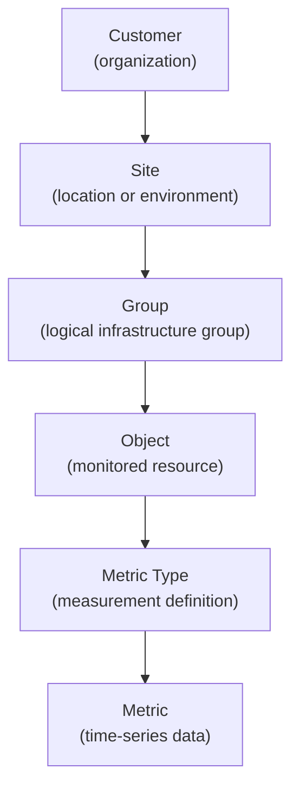

# Tree Hierarchy View

The **Tree Hierarchy View** provides a structured navigation of the entities that descend from a selected parent entity.

Unlike the **Connections View**, which displays lateral relationships between entities, the Tree Hierarchy View shows the hierarchical structure of the monitored environment.

---

## Where It Appears

The Tree Hierarchy View is available for entities that act as structural roots in the platform, such as:

- Customers
- Sites
- Groups

Selecting the **Link** icon associated with an entity opens the structure page where the hierarchy can be explored.

From this page users can switch between:

- **Tree Hierarchy View** – displays the hierarchical structure of infrastructure entities
- **Connections View** – displays lateral relationships between entities

---

## Layout

The page is typically divided into two areas:

- an **information panel** on the left showing the selected entity details
- a **hierarchy panel** on the right showing the descendant entities

The hierarchy panel allows users to progressively explore the monitored infrastructure associated with the selected entity.

---

## Hierarchical Navigation

The hierarchy is built dynamically according to the selected entity and its configuration.

Typical hierarchy levels include:

Depending on the entity type, the hierarchy may include custom tabs or alternative structures.

For example, the **Customer** view can display separate tabs such as:

* **Sites**
* **Service Profiles**

These tabs represent different logical hierarchies associated with the customer.

---

## Entity Actions

Each element displayed in the hierarchy provides a set of actions that allow users to inspect or manage the selected entity.

These actions appear as icons on the right side of each row.

### Metric Data

The **Metric Data** button opens a modal displaying the time-series data associated with the selected metric.

Depending on the metric type, the modal may display:

* a **chart** for value-based metrics
* a **table** for state metrics

This allows users to inspect the historical behavior of a monitored metric.

---

### Downtime

The **Downtime** button opens the **Active Downtimes** modal.

Downtimes temporarily suspend monitoring alerts for the selected entity.

Downtimes can be scheduled at multiple levels of the hierarchy, allowing administrators to silence alerts during maintenance or planned activities.

More details are available in **Downtimes**.

---

### Dispatcher

The **Dispatcher** button opens the **Active Dispatchers** modal.

Dispatchers define automated actions triggered by monitoring events.

More details are available in **Dispatchers**.

---

### Structure Navigation

The **Link** icon opens the structural page of the selected entity.

From this page users can explore both:

* the **Tree Hierarchy View**
* the **Connections View**

for that entity.

---

### Entity Details

The **Search** icon opens the **CRUD dialog** for the selected entity.

From this dialog users can:

* inspect entity details
* edit configuration
* duplicate records
* delete records

---

## Difference from Connections View

The **Tree Hierarchy View** shows structural descendants.

The **Connections View** shows lateral relationships between entities.

These two views complement each other:

* the tree explains **where an entity sits in the hierarchy**
* the connections explain **how an entity is linked to others**
