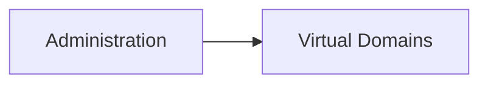

# Virtual Domains

The **Virtual Domains** entity represents logical partitions used to organize administrative and monitoring resources within the platform.

Virtual Domains are used to group and scope entities such as users, groups, and probes.

They provide an additional logical boundary that helps structure access and operational context across the platform.

---

## Accessing the Virtual Domains Section

Virtual Domains are managed from:

Unlike many other entities in the Data Manager, the **Virtual Domains** section does **not** open with a pre-filter dialog.

Instead, the page immediately displays the list of available virtual domains.

Users can then filter the displayed rows directly from the table.

---

## Virtual Domains Table

The Virtual Domains table displays the available records with the following main columns:

| Column      | Description                             |
| ----------- | --------------------------------------- |
| Code        | Unique identifier of the virtual domain |
| Description | Descriptive label of the virtual domain |

Each row provides access to two actions:

* **Connections view** (left icon) – opens the related entities connected to the selected virtual domain
* **Search / View** (magnifier icon) – opens the record in the CRUD dialog

---

## Virtual Domain Details

Opening a virtual domain record shows a simple CRUD dialog.

Typical fields include:

| Field       | Description                       |
| ----------- | --------------------------------- |
| Code        | Unique code of the virtual domain |
| Description | Descriptive name or label         |

From this dialog users can:

* edit the record
* duplicate the record
* delete the record

The virtual domain entity is intentionally lightweight and is primarily used as an organizational and relational container.

---

## Connections View

The **Connections View** is the main operational view for virtual domains.

When opening a virtual domain through the **Link** icon, the page displays:

* an information panel on the left
* a tabbed connections area on the right

The available tabs include:

* **Users**
* **Groups**
* **Probes**

This means a virtual domain can be used to associate and organize:

* user accounts
* infrastructure groups
* monitoring probes

---

## Users

The **Users** tab shows all user accounts linked to the selected virtual domain.

Typical columns include:

* User
* Email
* Phone
* Status

These links define which users belong to or operate within the selected virtual domain.

---

## Groups

The **Groups** tab shows the infrastructure groups associated with the virtual domain.

Typical columns include:

* Name
* Description
* Type
* Site
* Virtual Domain
* Status

These links allow groups to be organized inside the same logical administrative scope.

---

## Probes

The **Probes** tab shows the probes associated with the selected virtual domain.

Typical columns include:

* Severity
* Name
* Description
* Probe Type
* Virtual Domain
* Object
* Status

This relationship is important because probes inherit part of their operational context from the virtual domain they belong to.

---

## Role of Virtual Domains in the Platform

Virtual Domains provide a logical grouping layer between administration and monitoring.

They are used to:

* organize users into logical scopes
* associate probes with a shared administrative domain
* group infrastructure entities under the same operational context

This makes Virtual Domains particularly useful in multi-customer or multi-environment deployments, where administrative and monitoring boundaries need to be clearly separated.
