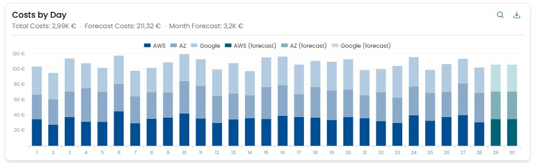
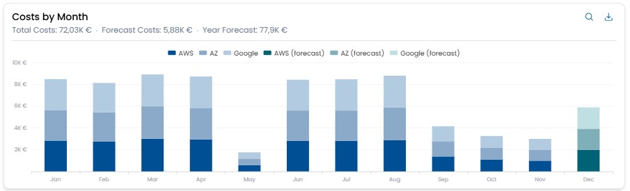
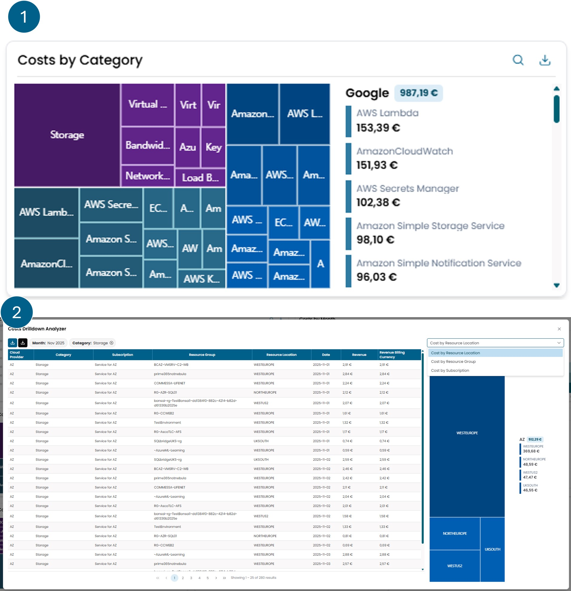
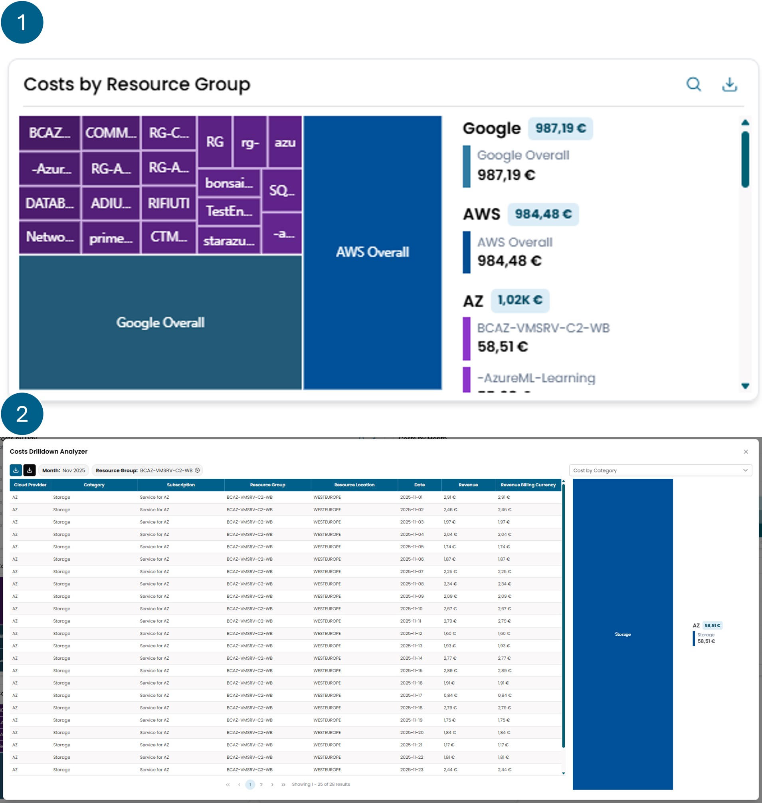
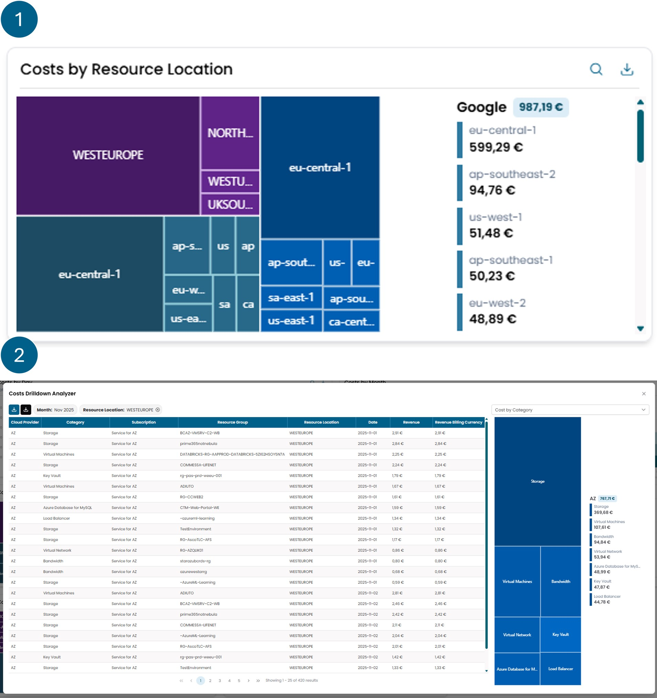

# Cloud Cost

## Costs Balance Month

Displays the cumulative trend of daily spending for the selected 
month, broken down by each cloud provider. If the selected month
is the current one, a forecast estimate of spending until the end
of the month is also displayed.

There is a button in the top right corner that allows you to 
download the values displayed in the widget in Excel format.

## Costs By Day

Shows the daily expenditure for the selected month,
detailing the breakdown between the different cloud providers. 
If the selected month is the current one, an estimate of the 
projected expenditure until the end of the month is also displayed.

There is a button in the top right corner that allows you to 
download the values displayed in the widget in Excel format.

## Costs By Month

The monthly spending for the selected year is displayed,
broken down by cloud provider. Additionally, a monthly spending 
forecast is provided until the end of the year.

Clicking on one of the bars that represent the expenses for a single
month opens a modal window with the details of the costs incurred during that period.

There is a button in the top right corner that allows you to 
download the values displayed in the widget in Excel format.

## Costs By Category

The widget is divided into two main views.  

The **first view** shows the cloud costs of various providers, 
grouped by *Category*.  
On the left is a graphical representation, while on the right
is a breakdown of the expenses.  
By clicking on one of the sections of the chart, you access the 
**second view**, where the costs that make up the selected category 
are displayed.  

From this screen, it is possible to apply further filters:  
you can choose a criterion from the dropdown menu in the upper 
right corner and then click on the corresponding slice that appears 
just below.  
This allows for progressively segmenting the cloud costs.  
The applied filters can be removed by clicking the cross next to the
filter name, located above the cost table.  

Also from this view, it is possible to:  

- download the details shown in the cost table using the **blue** download button, located in the upper left;  
- or export the report as provided directly by the cloud provider, with more complete information, using the **black** button next to the blue one.

There is a button in the top right corner that allows you to 
download the values displayed in the widget in Excel format.

## Costs By Subscription

The widget is divided into two main views.  

The **first view** shows the cloud costs of various providers, 
grouped by *Subscription*.  
On the left is a graphical representation, while on the right
is a breakdown of the expenses.  
By clicking on one of the sections of the chart, you access the 
**second view**, where the costs that make up the selected category 
are displayed.  

From this screen, it is possible to apply further filters:  
you can choose a criterion from the dropdown menu in the upper 
right corner and then click on the corresponding slice that appears 
just below.  
This allows for progressively segmenting the cloud costs.  
The applied filters can be removed by clicking the cross next to the
filter name, located above the cost table.  

Also from this view, it is possible to:  

- download the details shown in the cost table using the **blue** download button, located in the upper left;  
- or export the report as provided directly by the cloud provider, with more complete information, using the **black** button next to the blue one.

There is a button in the top right corner that allows you to 
download the values displayed in the widget in Excel format.

## Costs By Subscription Type

This widget shows the breakdown of the total monthly expenditure
across the different 
cloud providers for which a subscription is held.

There is a button in the top right corner that allows you to 
download the values displayed in the widget in Excel format.

## Costs By Resorurce Group

The widget is divided into two main views.  

The **first view** shows the cloud costs of various providers, 
grouped by *Resorurce Group*.  
On the left is a graphical representation, while on the right
is a breakdown of the expenses.  
By clicking on one of the sections of the chart, you access the 
**second view**, where the costs that make up the selected category 
are displayed.  

From this screen, it is possible to apply further filters:  
you can choose a criterion from the dropdown menu in the upper 
right corner and then click on the corresponding slice that appears 
just below.  
This allows for progressively segmenting the cloud costs.  
The applied filters can be removed by clicking the cross next to the
filter name, located above the cost table.  

Also from this view, it is possible to:  

- download the details shown in the cost table using the **blue** download button, located in the upper left;  
- or export the report as provided directly by the cloud provider, with more complete information, using the **black** button next to the blue one.

There is a button in the top right corner that allows you to 
download the values displayed in the widget in Excel format.

## Costs By Resorurce Location

The widget is divided into two main views.  

The **first view** shows the cloud costs of various providers, 
grouped by *Resorurce Location*.  
On the left is a graphical representation, while on the right
is a breakdown of the expenses.  
By clicking on one of the sections of the chart, you access the 
**second view**, where the costs that make up the selected category 
are displayed.  

From this screen, it is possible to apply further filters:  
you can choose a criterion from the dropdown menu in the upper 
right corner and then click on the corresponding slice that appears 
just below.  
This allows for progressively segmenting the cloud costs.  
The applied filters can be removed by clicking the cross next to the
filter name, located above the cost table.  

Also from this view, it is possible to:  

- download the details shown in the cost table using the **blue** download button, located in the upper left;  
- or export the report as provided directly by the cloud provider, with more complete information, using the **black** button next to the blue one.

There is a button in the top right corner that allows you to 
download the values displayed in the widget in Excel format.

## Cost Anomalies

This widget consists of two main views.  

The **first view** shows a list of reports representing
the various cost anomalies automatically identified by XAutomata.  
The reports are organized so that the most recent appear 
first. If a cost center has recurring reports, these are
grouped within the last report. By selecting it, you can
view the list of previous reports, if any.  

The **second view** opens by selecting a single report. 
This screen displays the details of the report and the
history of expenses related to that specific cost center.

There is a button in the top right corner that allows you to 
download the values displayed in the widget in Excel format.

!!! info

    **What is a cost anomaly?**

    A cost anomaly is an unexpected cost behavior, detected in 
    recent transactions. An anomaly does not necessarily involve a real 
    problem, but they are intended to keep track of costs that can 
    potentially be an indicator of some problems.

    This widget shows a list of all the anomalies detected in the current period, which can be of different types:

    - **Peak**: A cost considered to be significantly high compared to previous 3 months transactions.
    - **Total Peaks**: It is recognized if new cost centers are impacting total spending abnormally.
    - **Fraud Protection**: Using a time window of 3 months is established the behaviour of a cost centre and every 4 hours is verified if it exceed the expected expense.
    - **Forgotten**: A cost that is constantly increasing over time without any fluctuation over the previous 3 months.
    - **Geography**: A sudden cost in a geographic area where almost no costs have been produced for the past 3 months.
    - **Triple**: A total month cost which value has tripled from the same category of 2 month back.

