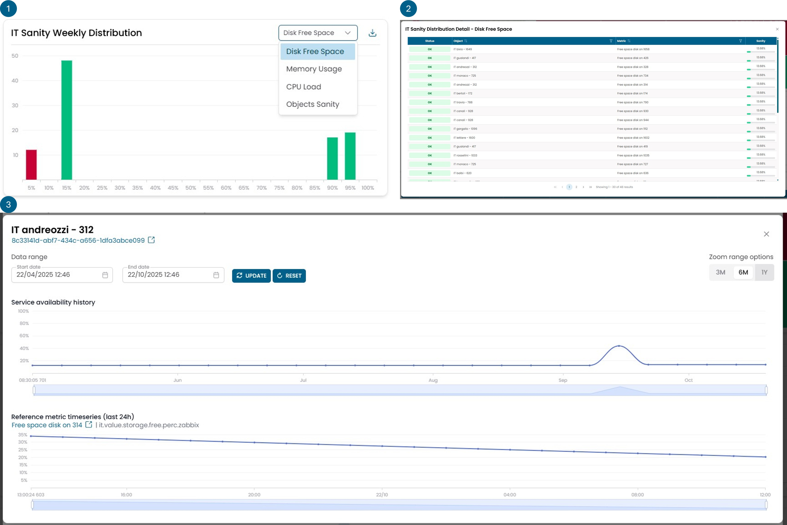

# IT Analytics

## IT Sanity Weekly Distribution
This widget represents a sanity value of an infrastructure object and allows 
for capacity planning of the same.

!!! info

    **What is sanity:** a value calculated based on the trends of the value metrics 
    of certain objects. Sanity serves as an indicator that tells whether an object is overused or underused for its sizing. Any object with a 0% sanity is considered overused for its sizing, while any object with a 100% sanity is considered underused for its sizing. Objects with a sanity greater than 0% and less than 100% are considered to be used correctly.

It is possible to select the type of objects for which to view capacity 
planning from a list of:

- Disk Free Space
- Memory Usage
- CPU Load
- Object Sanity

The first three categories are direct, while the fourth is a category made
up of the aggregation of the above. Every machine with more than one component 
will also have a sanity calculated based on the combination of the sanity of 
the individual components.

!!! Example

    Memory sanity helps to understand whether the infrastructure is 
    suffering from excessive memory use, but this provides a partial view of reality. 
    If we consider a database, it often allocates all the memory available to it even
    if it is not utilizing it. In this scenario, memory would be incorrectly indicated
    with a 0%. For this reason, the sanity of the entire machine has been created. 
    This type of sanity aims to approximate what is a more application-specific check, 
    where a 0% memory usage is weighed together with other characteristics, which can 
    lead to a collective sanity greater than 0, thus providing a more accurate estimation 
    of the health status of the example database.

Sanity is calculated based on the behavior of the value metrics on a weekly scale.

The widget consists of 3 views represented in the figure below with the three numbers. 

The first view shows a histogram that categorizes objects by their sanity. 
All objects with a sanity lower than 5% fall into the red column.

By clicking on one of the bars, a second view opens that shows in detail the 
objects contained in that column with the exact sanity value for each one.

By clicking on a specific object, a third view opens where the trend of the 
sanity over time for the selected object is displayed.

