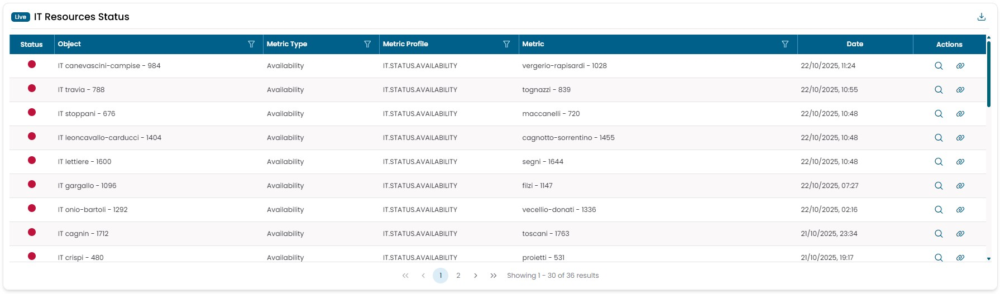

# IT Infrastructure

## Resource Groups Distribution Map

Shows the geographic distribution of all IT objects groups. The data are collected in real time.
By clicking on one of the dots you can access the detiled information of that object.
The color of the dots represent the status of the object, could be green, reb, yellow, purple, grey.

## Resource Groups Status

Shows the state of the resources groups.
The color of the boxs represent the status of the object, could be green, reb, yellow, purple, grey.
By clicking on a box you can drill down to explode each object to its metrics, to find which is the cause
of a problem.

## IT Resources Status

Shows the status of all resources of the IT infrastructure.
This is the widget that allow you to see each problem that is present on the infrastructure in 
any given time. The objects are sorted by color, having the reds on top, and by date, with the
most recent on top.
By clicking on the magnifying glass, you can view the history of the statuses associated with
that object. Meanwhile, clicking on the chain symbol opens a modal window with information
about the actions taken by the automata for managing that critical event.

## Objects Availability Percentage Monthly Average

This widget displays the percentage of infrastructure objects that have had an average availability
rate greater than 99.95% over the past month.

By clicking on the gauge you can open a new window with the time availability trend over 6 months.

*It does not represent the overall average availability of the infrastructure.*

!!! example

    If I have 4 infrastructure objects, 3 of them have a monthly average availability 
    of 100%, and one of them has a monthly average availability of 90%, this widget will show 
    an indication of 75%, since 3 out of 4 objects have a monthly average availability greater than 99.95%.

## IT Objects Weekly Availability Distribution

The widget consists of several views represented by the figure below with the three numbers.

The first view displays a histogram that categorizes various infrastructure objects 
based on their average availability calculated over the last week. All objects with 
an availability rate below 99.5% fall into the leftmost column, highlighted in red.

By clicking on one of the bars, you transition to the second view, which provides
detailed information on the objects present in that column and their exact average availability values.

Clicking on a specific object takes you to the third view, where the trend of that
object's availability over time is displayed.

