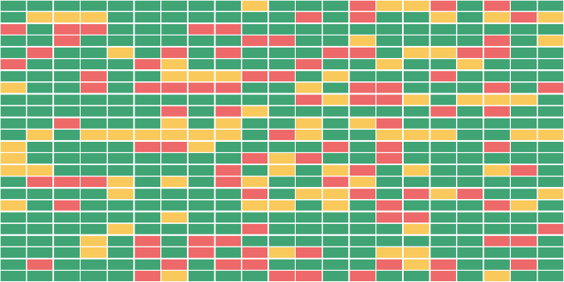

# Widget MCD dedicated

# Infrastructure

## Report Attività Reboot

## IT Groups List

Shows a graphic grid of all infrastructure Groups, sorted by name, representing their own status.

## Subset Groups Status

Shows a graphic grid of a customizable subset of infrastructure Groups, sorted by name, representing their own status based on a selectable specific metric.

## Active Downtimes

Shows the active downtimes of selected enity type.

## Next Active Downtimes

Shows the downtimes of selected entity type that will be active in the future.

# More dedicated widget groups

1. [Massive Reboot](widget_mcd_reboot.md)
2. [Rebuild VM](widget_mcd_rebuild_vm.md)
3. [Massive Downtime](widget_mcd_downtime.md)
