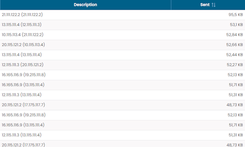
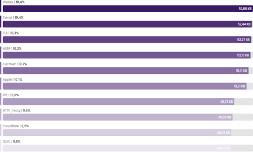

# NetFlow

The **NetFlow** widget group provides visibility into network traffic by highlighting the most active senders, receivers, applications, and protocols.

These widgets are useful for identifying traffic distribution and the main contributors to network activity within the selected period.

All widgets in this group share the same filtering model.

## Common Filters

The NetFlow widgets provide a common filter dialog that allows users to refine the displayed data according to:

- **Sites** – limits the analysis to the selected site
- **Dataset Interval** – defines the time interval used to aggregate the traffic data

These filters apply directly to the widget data and update the displayed values accordingly.

## Top Talkers

Shows the talkers generating the highest amount of traffic.

The widget is displayed as a table listing the main traffic sources and the corresponding transmitted traffic values.

## Top Receivers

Shows the receivers generating the highest amount of traffic.

The widget is displayed as a table listing the main traffic destinations and the corresponding received traffic values.

## Top Applications

Shows the top applications generating the highest amount of traffic.

The widget is displayed as a time-based chart, allowing users to observe how traffic is distributed among the main applications in the selected interval.

## Flow by Protocol

Shows the network protocols generating the highest amount of traffic.

The widget is displayed as a ranked list of protocols with their corresponding traffic values.

