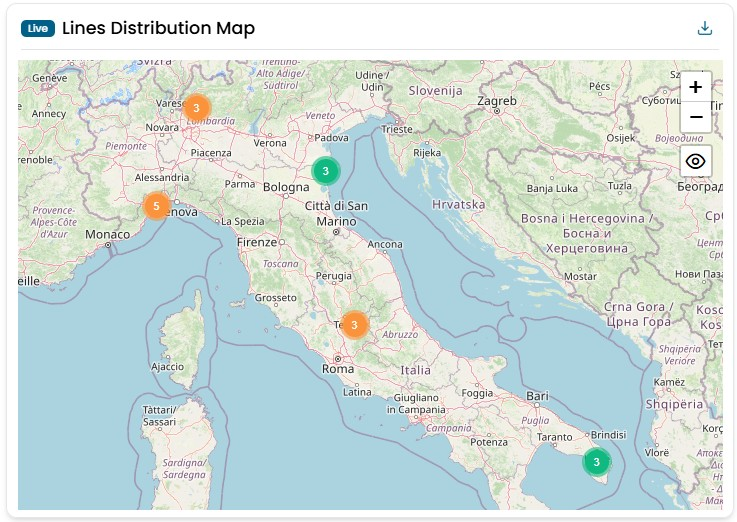
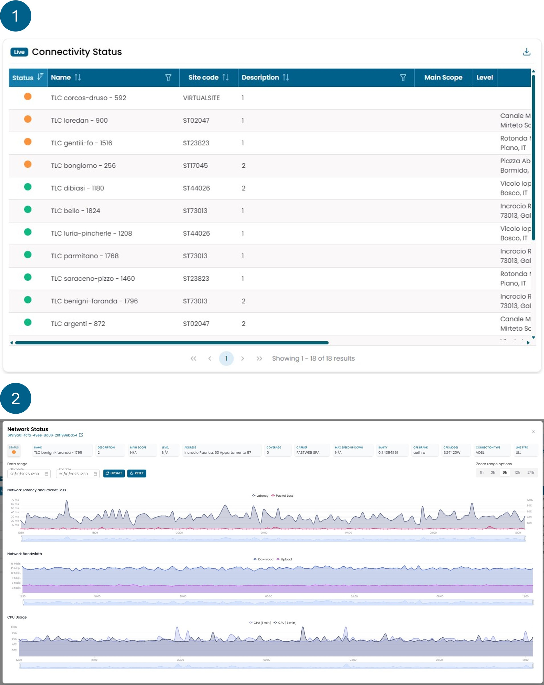
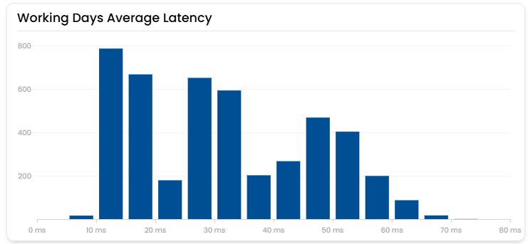
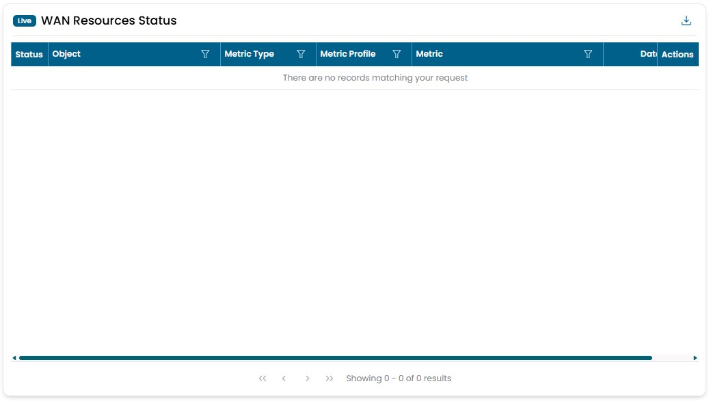

# Network

## Lines Distribution Map

Shows the geographic distribution of all network objects. The data are collected in real time.
By clicking on one of the dots you can access the detiled information of that object.
The color of the dots represent the status of the object, could be green, reb, yellow, purple, grey.

!!! info

    - **Red** indicates the presence of a problem.  
    - **Yellow** indicates the presence of a warning.  
    - **Green** represents the correct status of an object.  
    - **Purple** indicates that no data is being retrieved for the object.  
    - **Gray** represents an object that has no data.

## Connectivity Status

This widget consists of two views, described below.

The **first view** provides an overview of the quality of the monitored networks. The **color** associated with each network is determined by rules based on the **packet loss** value of the line. Each network is displayed as a row in a table, from which further information can be consulted, such as:

- source site of the network;
- type of connection (primary or backup);
- contractual maximum bandwidth values for upload and download;
- _sanity_ index.

The _sanity_ value shown in this table is calculated based on all metrics related to the network, analyzed over the last 24 hours (unlike other capacity planning widgets that focus on longer periods).

By selecting one of the networks, you access the **second view**, which displays details of the following parameters:

- Latency;
- Packet loss;
- Bandwidth consumption for upload and download;
- Average CPU usage over 1 and 5 minutes.

!!! info

    (_All values are calculated as the average of the last hour of data._)

    - **Green:** packet loss between 0% and 3%;
    - **Yellow:** packet loss between 3% and 30%;
    - **Red:** packet loss over 30%;
    - **Purple:** no packet loss data available for more than 6 hours.

!!! info

    **What is sanity:** a value calculated based on the trends of the value
    metrics of certain objects. Sanity serves as an indicator that tells whether
    an object is overused or underused for its sizing. Any object with a 0% sanity
    is considered overused for its sizing, while any object with a 100% sanity is
    considered underused for its sizing. Objects with a sanity greater than 0% and 
    less than 100% are considered to be used correctly.

## Working Days Average Latency

Questo widget mostra la latenza media oraria registrata dall’inizio del mese su tutte le linee della rete.  
Ogni barra indica il numero di volte in cui una linea ha avuto una determinata latenza media oraria nel periodo considerato.  

L’obiettivo del widget è fornire una visione immediata della qualità complessiva della rete.  
Una rete aziendale può essere considerata in buone condizioni se la maggior parte delle barre si colloca al di sotto dei 40 ms.

## WAN Resources Status

Shows the status of all network apparatus.
This is the widget that allow you to see each problem that is present on the netwrok in 
any given time. The objects are sorted by color, having the reds on top, and by date, with the
most recent on top.
By clicking on the magnifying glass, you can view the history of the statuses associated with
that object. Meanwhile, clicking on the chain symbol opens a modal window with information
about the actions taken by the automata for managing that critical event.

!!! info

    - **Red** indicates the presence of a problem.  
    - **Yellow** indicates the presence of a warning.  
    - **Green** represents the correct status of an object.  
    - **Purple** indicates that no data is being retrieved for the object.  
    - **Gray** represents an object that has no data.

