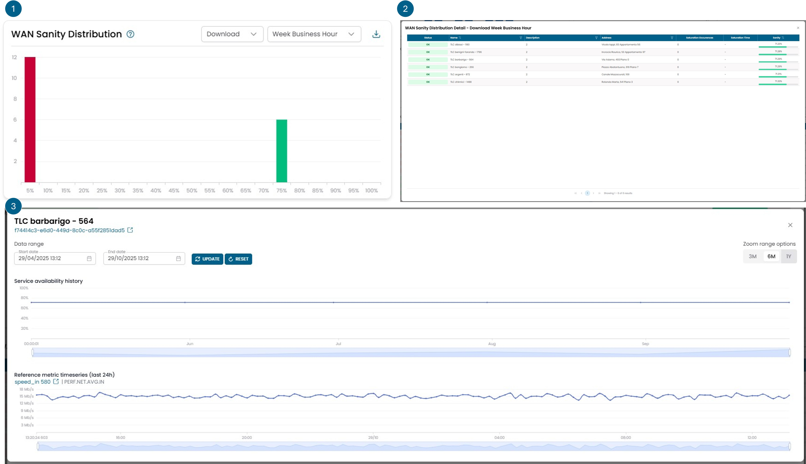
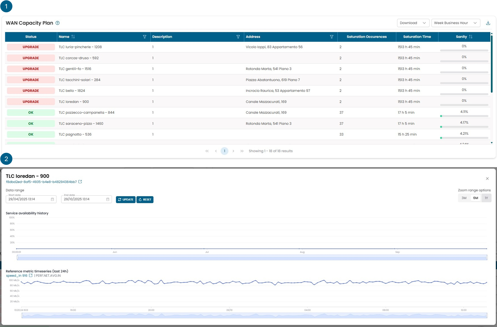

# Network Analytics

## WAN Sanity Distribution

This widget represents a sanity value of an network object and allows 
for capacity planning of the same.

!!! info

    **What is sanity:** a value calculated based on the trends of the value metrics 
    of certain objects. Sanity serves as an indicator that tells whether an object
    is overused or underused for its sizing. Any object with a 0% sanity is considered
    overused for its sizing, while any object with a 100% sanity is considered underused
    for its sizing. Objects with a sanity greater than 0% and less than 100% are considered 
    to be used correctly.

The Capacity Planning studies the selected metric behaviour and establish the its Sanity.

Statistics of the metric are evaluated to produce an assessment of the network, if a change
in line capacity is required, this is suggested.

Four different metrics are used to evaluate the Sanity:

- **Download:** Band width on the download.
- **Upload:** Band width on the upload.
- **Object:** Composit metric created combining speed upload, speed download, latency and packet loss.
- **Site:** Composit metric created combining the object metric of all the lines on a site.

Download/Upload provide the information of line usage against the contractual limits, 
Object and Site provide the information of the service quality.

A line with the Sanity greater then 0% has an acceptable usage,
but closer it gets to 0% larger is the consumption of the band. 
A line with the 0% Sanity needs an upgrade.

The Capacity Planning is evaluated over 5 different time windows:

- **24/7:** Ranging all hours of entire week.
- **Week Business Hour:** Ranging from 8:00 to 19:00, from Mon to Sun.
- **Week Out Business Hour:** ranging from 19:00 to 8:00, from Mon to Sun.
- **Work Week Business Hour:** Ranging from 8:00 to 19:00, from Mon to Fri.
- **Work Week out Business Hour:** Ranging from 8:00 to 19:00, from Mon to Fri.

Sanity is calculated based on the behavior of the value metrics on a monthly scale.

The widget consists of 3 views represented in the figure below with the three numbers. 

The first view shows a histogram that categorizes objects by their sanity. 
All objects with a sanity lower than 5% fall into the red column.

By clicking on one of the bars, a second view opens that shows in detail the 
objects contained in that column with the exact sanity value for each one.

By clicking on a specific object, a third view opens with the trend of the 
sanity over time and the values of the relevant metric used to evaluate that sanity as well.

## WAN Capacity Plan

This widget represents a sanity value of an network object and allows 
for capacity planning of the same.

!!! info

    **What is sanity:** a value calculated based on the trends of the value metrics 
    of certain objects. Sanity serves as an indicator that tells whether an object
    is overused or underused for its sizing. Any object with a 0% sanity is considered
    overused for its sizing, while any object with a 100% sanity is considered underused
    for its sizing. Objects with a sanity greater than 0% and less than 100% are considered 
    to be used correctly.

The Capacity Planning studies the selected metric behaviour and establish the its Sanity.

Statistics of the metric are evaluated to produce an assessment of the network, if a change
in line capacity is required, this is suggested.

Four different metrics are used to evaluate the Sanity:

- **Download:** Band width on the download.
- **Upload:** Band width on the upload.
- **Object:** Composit metric created combining speed upload, speed download, latency and packet loss.
- **Site:** Composit metric created combining the object metric of all the lines on a site.

Download/Upload provide the information of line usage against the contractual limits, 
Object and Site provide the information of the service quality.

A line with the Sanity greater then 0% has an acceptable usage,
but closer it gets to 0% larger is the consumption of the band. 
A line with the 0% Sanity needs an upgrade.

The Capacity Planning is evaluated over 5 different time windows:

- **24/7:** Ranging all hours of entire week.
- **Week Business Hour:** Ranging from 8:00 to 19:00, from Mon to Sun.
- **Week Out Business Hour:** ranging from 19:00 to 8:00, from Mon to Sun.
- **Work Week Business Hour:** Ranging from 8:00 to 19:00, from Mon to Fri.
- **Work Week out Business Hour:** Ranging from 8:00 to 19:00, from Mon to Fri.

Sanity is calculated based on the behavior of the value metrics on a monthly scale.

The widget consists of 2 views represented in the figure below with the three numbers. 

The first view shows all the objects ordered by sanity.

By clicking on a specific object, a third view opens with the trend of the 
sanity over time and the values of the relevant metric used to evaluate that sanity as well.

