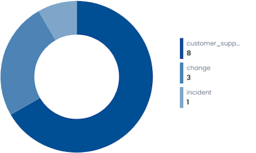
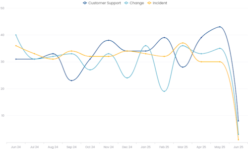

# Support Service KPI

The **Support Service KPI** widgets provide analytical views of the support tickets managed through the system.

These widgets allow users to explore events closed during the selected period and analyze them according to different operational dimensions such as severity, responsibility, organization, or SLA compliance.

All widgets in this section share the same interaction model and drilldown interface.

## Event Analysis Widgets

The following widgets display the number of events closed during the current month, grouped according to a specific category.

Each widget is displayed as a **donut chart**, where each segment represents the number of events belonging to a specific category.

### Widget Interaction

Clicking on a segment of the chart opens a **drilldown view** filtered by the selected category.

Alternatively, clicking on the **magnifying glass icon** opens the drilldown view showing the complete list of events.

### Drilldown View

The drilldown view displays a table containing the detailed list of events.

A dropdown menu allows the user to change the analysis dimension dynamically.

The available dimensions are:

- Events by SLA of Taking Charge
- Events by Opening Mode
- Events by Organization
- Events by Responsibility
- Events by Severity

When a dimension is selected, the donut chart is updated to reflect the chosen categorization.

Clicking on a segment of the donut applies an additional filter to the event list.  
This filtering process can be repeated multiple times, progressively narrowing the results.

All active filters are displayed above the table.

### Data Export

Both the widget and the drilldown view include a **download button** that allows exporting the currently displayed data in **XLSX format**.

## Available Views

The Event Analysis widget can be initially configured to display events grouped by different categories:

- **Events by Type**
- **Events by Opening Mode**
- **Events by Severity**
- **Events by Responsibility**
- **Events by Organization**
- **Events by SLA of Taking Charge**

Although these widgets appear separately in the dashboard, they all use the same analysis engine and drilldown interface.

## Events History by Type

This widget shows the history of all events closed during the last year, grouped by event type.

## Events by SLA of Resolution

This widget shows the number of events closed in the current month grouped by **event severity**, highlighting whether the resolution respected the defined SLA.

The chart is displayed as a **stacked column chart** where:

- the **blue segment** represents events resolved **within the SLA**
- the **red segment** represents events resolved **outside the SLA**

Each column corresponds to an event severity level.

Moving the cursor over a column displays a **tooltip** with the exact number of events resolved **In SLA** and **Off SLA**.

### Data Export

The **download button** in the top-right corner allows exporting the data displayed in the widget in **XLSX format**.