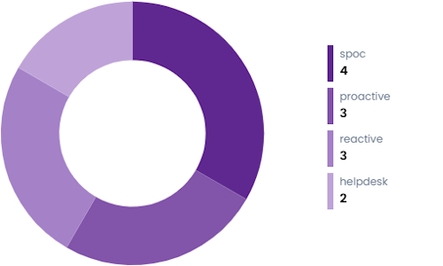
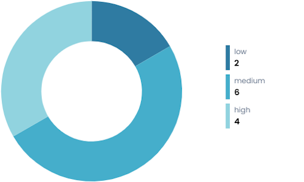
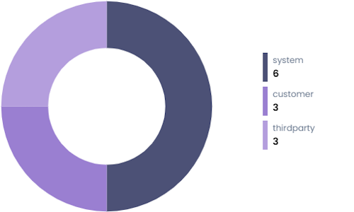
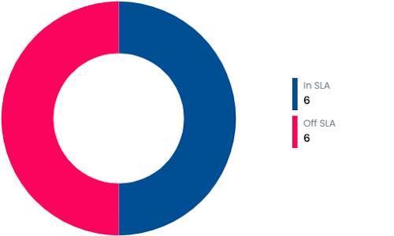
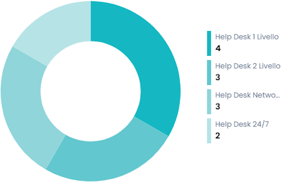

# Support Service KPI

## Events by Type

Shows all events closed in current month grouped by event type.

## Events by Opening Mode

Shows all events closed in current month grouped by event opening mode.

## Events by Severity

Shows all events closed in current month grouped by event severity.

## Events History by Type

Shows the history all events closed in last year grouped by event type.

## Events by Responsibility

Shows all events closed in current month grouped by event responsibility.

## Events by SLA of Taking Charge

Shows all events closed in current month grouped by SLA of taking charge.

## Events by SLA of Resolution

Shows all events closed in current month grouped by SLA of resolution for each event severity.

## Events by Organization

Shows all events closed in current month grouped by event organization.

