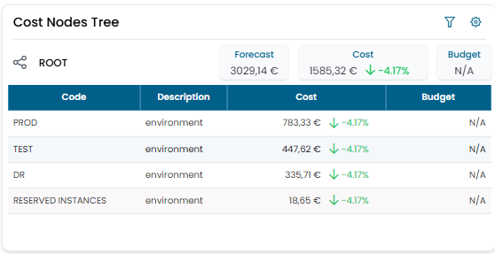
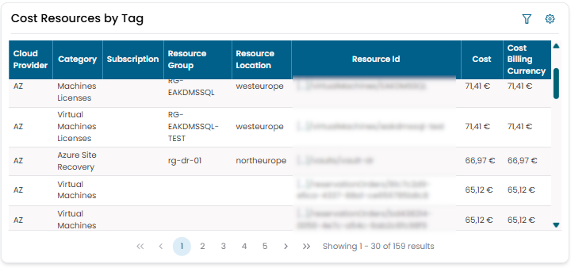

# Analytical Accounting

The **Analytical Accounting** widget group displays cloud costs organized according to the hierarchical structures defined in **Cost Views**.

Unlike the Cloud Cost widgets — which show raw billing data as provided by the cloud vendor — these widgets reflect your organization's internal cost model.

!!! note
    When configuring an Analytical Accounting widget for the first time, you must select the **Cost View** the widget will use as its reference structure. A single customer can have multiple Cost Views, each representing a different organizational perspective.

---

## Cost Nodes Tree

Shows the full cost node hierarchy for the selected Cost View, with actual costs aggregated per node.



Clicking on a node row **drills down** into that node's children, progressively narrowing the view to sub-nodes. Navigate back up using the breadcrumb at the top of the widget.

This widget is the primary tool for exploring costs by your organization's internal structure — for example navigating from an environment level down to individual workloads or resource types.

---

## Cost Resources by Tag

Shows all cost resources for the selected Cost View in the reference month, filterable by cloud tags.



### Tag filters

Click the **filter icon** to open the **Filters** dialog.

| Filter | Description |
|---|---|
| **Selected Tags** | Tags that the resource must match to be included |
| **Excluded Tags** | Tags that, if present, exclude the resource from the results |

For each filter you can choose the logical operator applied across the selected tags:

| Operator | Behaviour |
|---|---|
| **OR (Union)** | The resource matches if it has **at least one** of the selected tags |
| **AND (Intersection)** | The resource matches only if it has **all** of the selected tags |

The two filters combine as:

```
results = resources matching Selected Tags  MINUS  resources matching Excluded Tags
```

This allows queries such as:
- show all resources tagged `environment=PROD` **or** `environment=DR`, **excluding** those tagged `type=VPN`
- show only resources tagged **both** `virtual machine=eakdmsAPI` **and** `environment=PROD`

Enable **Save Filters** to persist the current filter configuration across sessions.

!!! note
    Tags are sourced from the cloud provider billing data. Their availability depends on the tagging conventions used in your cloud environment.
    For questions about tag origins, see [Q2 in the Q&A log](../../qa.md).
