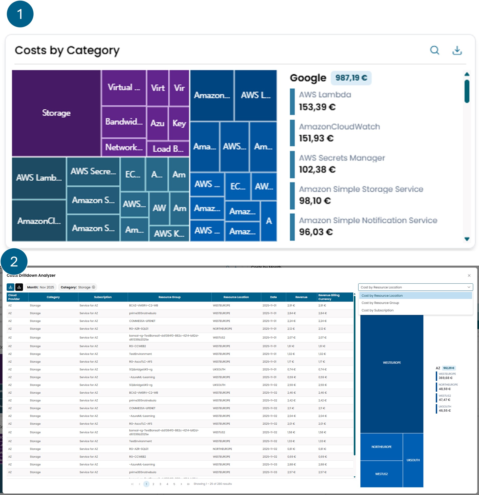
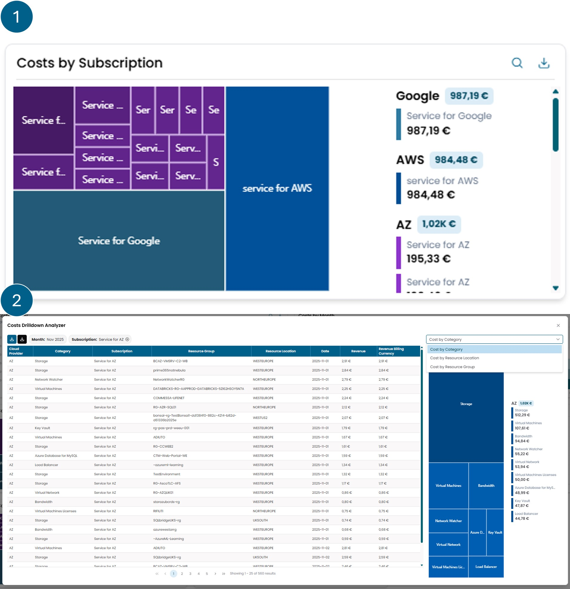

# Cloud Cost

## Costs Balance Month

Mostra il trend cumulativo della spesa giornaliera per il mese selezionato,
suddiviso per ciascun cloud provider. Se il mese selezionato è quello corrente,
viene visualizzata anche una stima previsionale della spesa fino a fine mese.

Nell'angolo in alto a destra è presente un pulsante che consente di scaricare
i valori visualizzati nel widget in formato Excel.

## Costs By Day

Mostra la spesa giornaliera per il mese selezionato,
con il dettaglio della suddivisione tra i diversi cloud provider.
Se il mese selezionato è quello corrente, viene visualizzata anche una stima
della spesa prevista fino a fine mese.

Nell'angolo in alto a destra è presente un pulsante che consente di scaricare
i valori visualizzati nel widget in formato Excel.

## Costs By Month

Viene visualizzata la spesa mensile per l'anno selezionato,
suddivisa per cloud provider. Viene inoltre fornita una previsione
della spesa mensile fino a fine anno.

Cliccando su una delle barre che rappresentano le spese per un singolo
mese si apre una finestra modale con i dettagli dei costi sostenuti in quel periodo.

Nell'angolo in alto a destra è presente un pulsante che consente di scaricare
i valori visualizzati nel widget in formato Excel.

## Costs By Category

Il widget è suddiviso in due viste principali.

La **prima vista** mostra i costi cloud dei vari provider,
raggruppati per *Category*.
A sinistra è presente una rappresentazione grafica, mentre a destra
è riportata la suddivisione delle spese.
Cliccando su una delle sezioni del grafico si accede alla
**seconda vista**, dove vengono mostrati i costi che compongono la categoria selezionata.

Da questa schermata è possibile applicare ulteriori filtri:
puoi scegliere un criterio dal menu a tendina nell'angolo in alto a destra
e poi cliccare sulla fetta corrispondente che appare appena sotto.
Questo consente di segmentare progressivamente i costi cloud.
I filtri applicati possono essere rimossi cliccando sulla x accanto al nome
del filtro, situata sopra la tabella dei costi.

Sempre da questa vista è possibile:

- scaricare i dettagli mostrati nella tabella dei costi usando il pulsante di download **blu**, posizionato in alto a sinistra;
- oppure esportare il report come fornito direttamente dal cloud provider, con informazioni più complete, usando il pulsante **nero** accanto a quello blu.

Nell'angolo in alto a destra è presente un pulsante che consente di scaricare
i valori visualizzati nel widget in formato Excel.

## Costs By Subscription

Il widget è suddiviso in due viste principali.

La **prima vista** mostra i costi cloud dei vari provider,
raggruppati per *Subscription*.
A sinistra è presente una rappresentazione grafica, mentre a destra
è riportata la suddivisione delle spese.
Cliccando su una delle sezioni del grafico si accede alla
**seconda vista**, dove vengono mostrati i costi che compongono la categoria selezionata.

Da questa schermata è possibile applicare ulteriori filtri:
puoi scegliere un criterio dal menu a tendina nell'angolo in alto a destra
e poi cliccare sulla fetta corrispondente che appare appena sotto.
Questo consente di segmentare progressivamente i costi cloud.
I filtri applicati possono essere rimossi cliccando sulla x accanto al nome
del filtro, situata sopra la tabella dei costi.

Sempre da questa vista è possibile:

- scaricare i dettagli mostrati nella tabella dei costi usando il pulsante di download **blu**, posizionato in alto a sinistra;
- oppure esportare il report come fornito direttamente dal cloud provider, con informazioni più complete, usando il pulsante **nero** accanto a quello blu.

Nell'angolo in alto a destra è presente un pulsante che consente di scaricare
i valori visualizzati nel widget in formato Excel.

## Costs By Subscription Type

Questo widget mostra la suddivisione della spesa mensile totale
tra i diversi cloud provider per i quali è attiva una subscription.

Nell'angolo in alto a destra è presente un pulsante che consente di scaricare
i valori visualizzati nel widget in formato Excel.

## Costs By Resource Group

Il widget è suddiviso in due viste principali.

La **prima vista** mostra i costi cloud dei vari provider,
raggruppati per *Resource Group*.
A sinistra è presente una rappresentazione grafica, mentre a destra
è riportata la suddivisione delle spese.
Cliccando su una delle sezioni del grafico si accede alla
**seconda vista**, dove vengono mostrati i costi che compongono la categoria selezionata.

Da questa schermata è possibile applicare ulteriori filtri:
puoi scegliere un criterio dal menu a tendina nell'angolo in alto a destra
e poi cliccare sulla fetta corrispondente che appare appena sotto.
Questo consente di segmentare progressivamente i costi cloud.
I filtri applicati possono essere rimossi cliccando sulla x accanto al nome
del filtro, situata sopra la tabella dei costi.

Sempre da questa vista è possibile:

- scaricare i dettagli mostrati nella tabella dei costi usando il pulsante di download **blu**, posizionato in alto a sinistra;
- oppure esportare il report come fornito direttamente dal cloud provider, con informazioni più complete, usando il pulsante **nero** accanto a quello blu.

Nell'angolo in alto a destra è presente un pulsante che consente di scaricare
i valori visualizzati nel widget in formato Excel.

## Costs By Resource Location

Il widget è suddiviso in due viste principali.

La **prima vista** mostra i costi cloud dei vari provider,
raggruppati per *Resource Location*.
A sinistra è presente una rappresentazione grafica, mentre a destra
è riportata la suddivisione delle spese.
Cliccando su una delle sezioni del grafico si accede alla
**seconda vista**, dove vengono mostrati i costi che compongono la categoria selezionata.

Da questa schermata è possibile applicare ulteriori filtri:
puoi scegliere un criterio dal menu a tendina nell'angolo in alto a destra
e poi cliccare sulla fetta corrispondente che appare appena sotto.
Questo consente di segmentare progressivamente i costi cloud.
I filtri applicati possono essere rimossi cliccando sulla x accanto al nome
del filtro, situata sopra la tabella dei costi.

Sempre da questa vista è possibile:

- scaricare i dettagli mostrati nella tabella dei costi usando il pulsante di download **blu**, posizionato in alto a sinistra;
- oppure esportare il report come fornito direttamente dal cloud provider, con informazioni più complete, usando il pulsante **nero** accanto a quello blu.

Nell'angolo in alto a destra è presente un pulsante che consente di scaricare
i valori visualizzati nel widget in formato Excel.

## Cost Anomalies

Questo widget è composto da due viste principali.

La **prima vista** mostra un elenco di report che rappresentano
le varie anomalie di costo identificate automaticamente da XAUTOMATA.
I report sono organizzati in modo che i più recenti appaiano per primi.
Se un centro di costo ha report ricorrenti, questi vengono raggruppati
nell'ultimo report. Selezionandolo, puoi visualizzare l'elenco dei report precedenti, se presenti.

La **seconda vista** si apre selezionando un singolo report.
Questa schermata mostra i dettagli del report e la cronologia
delle spese relative a quel centro di costo specifico.

Nell'angolo in alto a destra è presente un pulsante che consente di scaricare
i valori visualizzati nel widget in formato Excel.

!!! info

    **Cos'è un'anomalia di costo?**

    Un'anomalia di costo è un comportamento di spesa inatteso, rilevato nelle
    transazioni recenti. Un'anomalia non implica necessariamente un problema reale,
    ma serve a tenere traccia di costi che possono potenzialmente essere indicatori di problemi.

    Questo widget mostra un elenco di tutte le anomalie rilevate nel periodo corrente, che possono essere di diverso tipo:

    - **Peak**: Un costo considerato significativamente elevato rispetto alle transazioni dei 3 mesi precedenti.
    - **Total Peaks**: Viene riconosciuto quando nuovi centri di costo impattano la spesa totale in modo anomalo.
    - **Fraud Protection**: Utilizzando una finestra temporale di 3 mesi viene stabilito il comportamento di un centro di costo e ogni 4 ore viene verificato se supera la spesa prevista.
    - **Forgotten**: Un costo in costante aumento nel tempo senza fluttuazioni nei 3 mesi precedenti.
    - **Geography**: Un costo improvviso in un'area geografica dove quasi nessun costo è stato generato negli ultimi 3 mesi.
    - **Triple**: Un costo mensile totale il cui valore è triplicato rispetto alla stessa categoria di 2 mesi fa.

