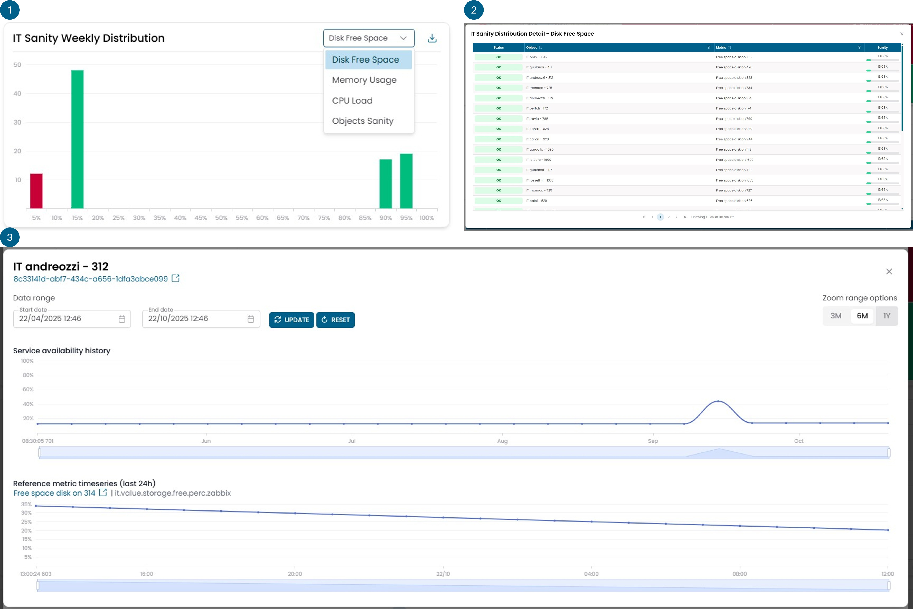

# IT Analytics

## IT Sanity Weekly Distribution

Questo widget rappresenta il valore di sanity di un oggetto infrastrutturale e consente
di effettuare il capacity planning dello stesso.

!!! info

    **Cos'è la sanity:** un valore calcolato in base ai trend delle metriche di valore
    di determinati oggetti. La sanity è un indicatore che segnala se un oggetto è sovra-utilizzato o sotto-utilizzato rispetto al suo dimensionamento. Qualsiasi oggetto con una sanity dello 0% è considerato sovra-utilizzato rispetto al suo dimensionamento, mentre qualsiasi oggetto con una sanity del 100% è considerato sotto-utilizzato. Gli oggetti con una sanity maggiore dello 0% e minore del 100% sono considerati correttamente utilizzati.

È possibile selezionare il tipo di oggetti per cui visualizzare il capacity planning
da un elenco che comprende:

- Disk Free Space
- Memory Usage
- CPU Load
- Object Sanity

Le prime tre categorie sono dirette, mentre la quarta è una categoria composta
dall'aggregazione delle precedenti. Ogni macchina con più di un componente
avrà anche una sanity calcolata in base alla combinazione della sanity
dei singoli componenti.

!!! example

    La sanity della memoria aiuta a capire se l'infrastruttura soffre di un utilizzo
    eccessivo della memoria, ma fornisce una visione parziale della realtà.
    Se consideriamo un database, spesso alloca tutta la memoria disponibile anche
    quando non la utilizza. In questo scenario, la memoria sarebbe erroneamente indicata
    con uno 0%. Per questo motivo è stata creata la sanity dell'intera macchina.
    Questo tipo di sanity mira ad approssimare un controllo più specifico per applicazione,
    dove uno 0% di utilizzo della memoria viene pesato insieme ad altre caratteristiche,
    il che può portare a una sanity collettiva maggiore di 0, fornendo così una stima
    più accurata dello stato di salute del database di esempio.

La sanity viene calcolata in base al comportamento delle metriche di valore su scala settimanale.

Il widget è composto da 3 viste rappresentate nella figura con i tre numeri.

La prima vista mostra un istogramma che categorizza gli oggetti in base alla loro sanity.
Tutti gli oggetti con una sanity inferiore al 5% rientrano nella colonna rossa.

Cliccando su una delle barre si apre una seconda vista che mostra in dettaglio gli
oggetti contenuti in quella colonna con il valore esatto di sanity per ciascuno.

Cliccando su un oggetto specifico si apre una terza vista dove viene visualizzato
il trend della sanity nel tempo per l'oggetto selezionato.

