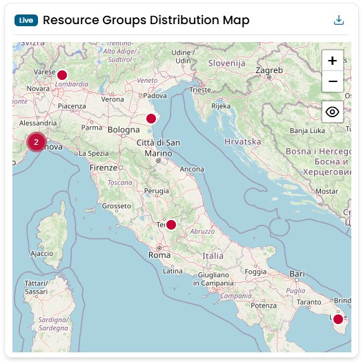
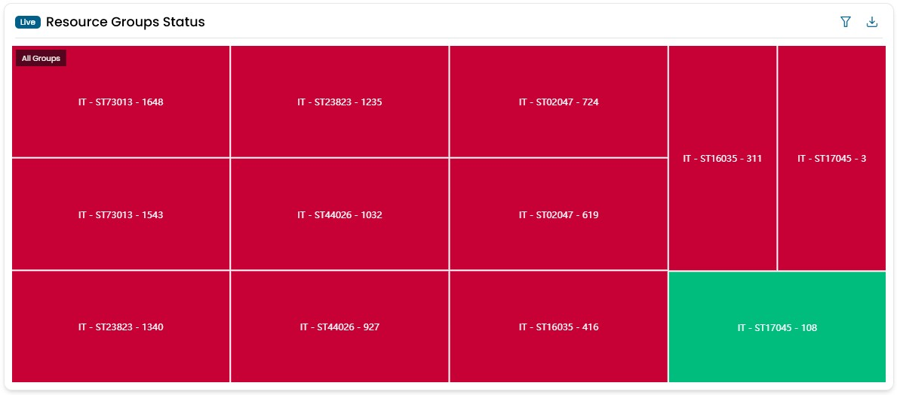
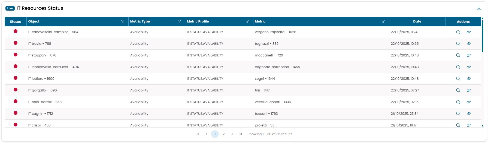
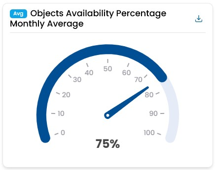
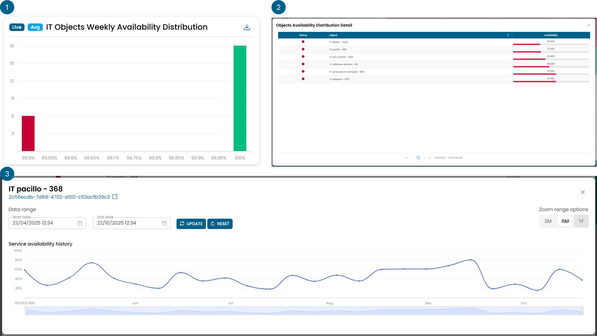

# IT Infrastructure

## Resource Groups Distribution Map

Mostra la distribuzione geografica di tutti i gruppi di oggetti IT. I dati vengono raccolti in tempo reale.
Cliccando su uno dei punti puoi accedere alle informazioni dettagliate di quell'oggetto.
Il colore dei punti rappresenta lo stato dell'oggetto: verde, rosso, giallo, viola o grigio.

!!! info

    - **Rosso** indica la presenza di un problema.
    - **Giallo** indica la presenza di un avviso.
    - **Verde** rappresenta lo stato corretto di un oggetto.
    - **Viola** indica che non vengono ricevuti dati per l'oggetto.
    - **Grigio** rappresenta un oggetto che non ha dati.

## Resource Groups Status

Mostra lo stato dei gruppi di risorse.
Il colore dei riquadri rappresenta lo stato dell'oggetto: verde, rosso, giallo, viola o grigio.
Cliccando su un riquadro puoi eseguire il drill-down per espandere ciascun oggetto fino alle sue metriche,
per individuare la causa di un problema.

!!! info

    - **Rosso** indica la presenza di un problema.
    - **Giallo** indica la presenza di un avviso.
    - **Verde** rappresenta lo stato corretto di un oggetto.
    - **Viola** indica che non vengono ricevuti dati per l'oggetto.
    - **Grigio** rappresenta un oggetto che non ha dati.

## IT Resources Status

Mostra lo stato di tutte le risorse dell'infrastruttura IT.
È il widget che ti consente di vedere in qualsiasi momento tutti i problemi presenti sull'infrastruttura.
Gli oggetti sono ordinati per colore, con i rossi in cima, e per data, con i più recenti in cima.
Cliccando sulla lente di ingrandimento puoi visualizzare lo storico degli stati associati a quell'oggetto.
Cliccando sul simbolo della catena si apre una finestra modale con le informazioni sulle azioni intraprese dagli automi per la gestione di quell'evento critico.

!!! info

    - **Rosso** indica la presenza di un problema.
    - **Giallo** indica la presenza di un avviso.
    - **Verde** rappresenta lo stato corretto di un oggetto.
    - **Viola** indica che non vengono ricevuti dati per l'oggetto.
    - **Grigio** rappresenta un oggetto che non ha dati.

## Objects Availability Percentage Monthly Average

Questo widget mostra la percentuale di oggetti infrastrutturali che hanno avuto una disponibilità media
superiore al 99,95% nell'ultimo mese.

Cliccando sul gauge puoi aprire una nuova finestra con il trend di disponibilità nel tempo negli ultimi 6 mesi.

*Non rappresenta la disponibilità media complessiva dell'infrastruttura.*

!!! example

    Se ho 4 oggetti infrastrutturali, 3 dei quali hanno una disponibilità media mensile del 100%
    e uno ha una disponibilità media mensile del 90%, questo widget mostrerà il 75%,
    poiché 3 oggetti su 4 hanno una disponibilità media mensile superiore al 99,95%.

## IT Objects Weekly Availability Distribution

Il widget è composto da più viste rappresentate dalla figura con i tre numeri.

La prima vista mostra un istogramma che categorizza i vari oggetti infrastrutturali
in base alla loro disponibilità media calcolata nell'ultima settimana. Tutti gli oggetti con
una disponibilità inferiore al 99,5% rientrano nella colonna più a sinistra, evidenziata in rosso.

Cliccando su una delle barre passi alla seconda vista, che fornisce
informazioni dettagliate sugli oggetti presenti in quella colonna e sui loro valori esatti di disponibilità media.

Cliccando su un oggetto specifico accedi alla terza vista, dove viene mostrato il trend
della disponibilità di quell'oggetto nel tempo.

