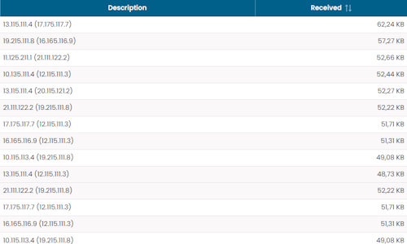
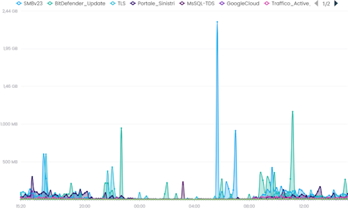

# NetFlow

Il gruppo di widget **NetFlow** fornisce visibilità sul traffico di rete evidenziando i mittenti, i destinatari, le applicazioni e i protocolli più attivi.

Questi widget sono utili per identificare la distribuzione del traffico e i principali contribuenti all'attività di rete nel periodo selezionato.

Tutti i widget di questo gruppo condividono lo stesso modello di filtro.

## Filtri Comuni

I widget NetFlow forniscono un dialog di filtro comune che consente di affinare i dati visualizzati in base a:

- **Sites** – limita l'analisi al sito selezionato
- **Dataset Interval** – definisce l'intervallo temporale utilizzato per aggregare i dati di traffico

Questi filtri si applicano direttamente ai dati del widget e aggiornano i valori visualizzati di conseguenza.

## Top Talkers

Mostra i talker che generano la maggiore quantità di traffico.

Il widget viene visualizzato come una tabella che elenca le principali sorgenti di traffico e i corrispondenti valori di traffico trasmesso.

## Top Receivers

Mostra i receiver che ricevono la maggiore quantità di traffico.

Il widget viene visualizzato come una tabella che elenca le principali destinazioni di traffico e i corrispondenti valori di traffico ricevuto.

## Top Applications

Mostra le applicazioni che generano la maggiore quantità di traffico.

Il widget viene visualizzato come un grafico temporale, che consente di osservare come il traffico è distribuito tra le principali applicazioni nell'intervallo selezionato.

## Flow by Protocol

Mostra i protocolli di rete che generano la maggiore quantità di traffico.

Il widget viene visualizzato come una lista ordinata di protocolli con i corrispondenti valori di traffico.

