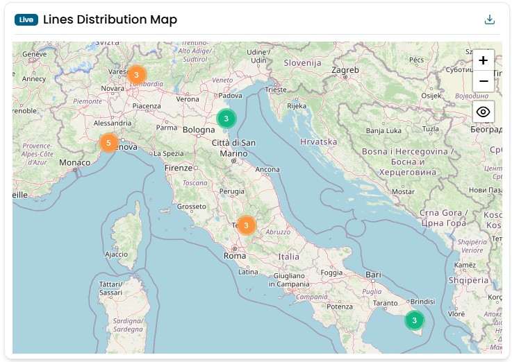
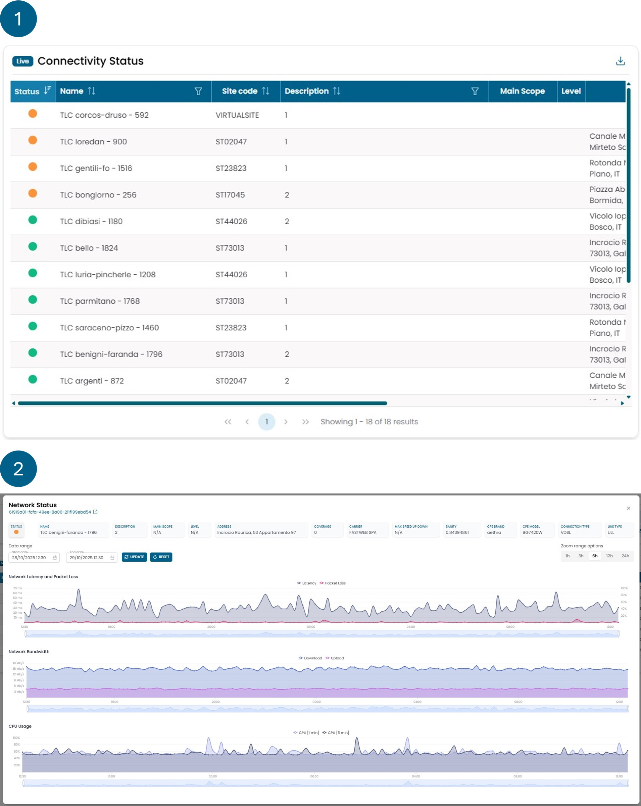
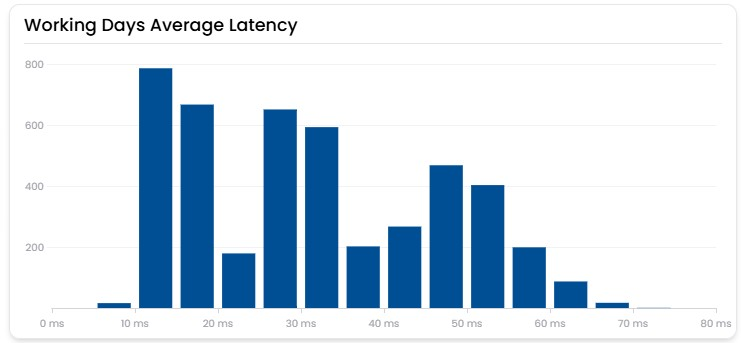
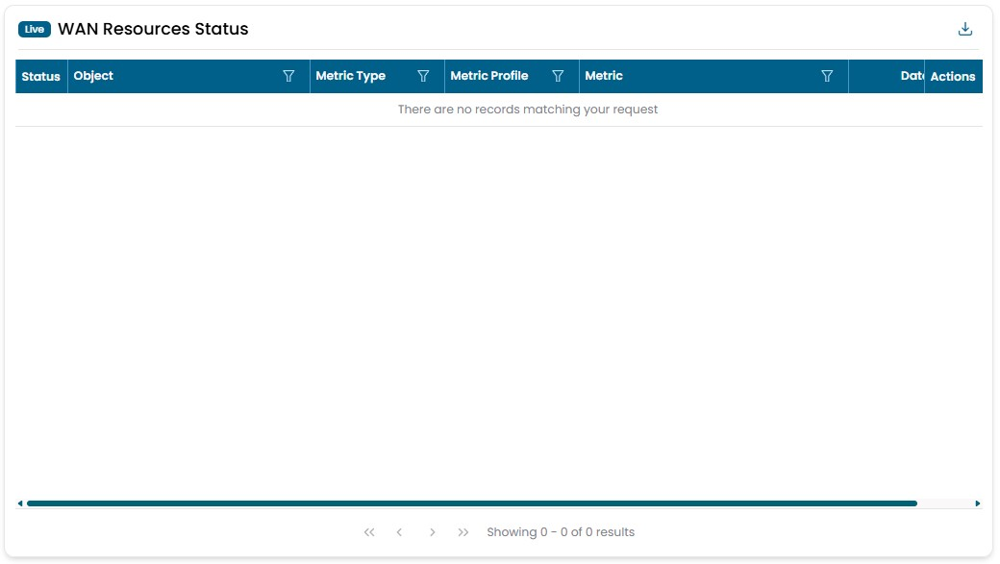

# Network

## Lines Distribution Map

Mostra la distribuzione geografica di tutti gli oggetti di rete. I dati vengono raccolti in tempo reale.
Cliccando su uno dei punti puoi accedere alle informazioni dettagliate di quell'oggetto.
Il colore dei punti rappresenta lo stato dell'oggetto: verde, rosso, giallo, viola o grigio.

!!! info

    - **Rosso** indica la presenza di un problema.
    - **Giallo** indica la presenza di un avviso.
    - **Verde** rappresenta lo stato corretto di un oggetto.
    - **Viola** indica che non vengono ricevuti dati per l'oggetto.
    - **Grigio** rappresenta un oggetto che non ha dati.

## Connectivity Status

Questo widget è composto da due viste, descritte di seguito.

La **prima vista** fornisce una panoramica della qualità delle reti monitorate. Il **colore** associato a ciascuna rete è determinato da regole basate sul valore di **packet loss** della linea. Ogni rete viene visualizzata come una riga in una tabella, dalla quale è possibile consultare ulteriori informazioni, tra cui:

- sito sorgente della rete;
- tipo di connessione (primaria o backup);
- valori contrattuali di banda massima per upload e download;
- indice di _sanity_.

Il valore di _sanity_ mostrato in questa tabella è calcolato in base a tutte le metriche relative alla rete, analizzate nelle ultime 24 ore (a differenza di altri widget di capacity planning che si concentrano su periodi più lunghi).

Selezionando una delle reti, accedi alla **seconda vista**, che mostra i dettagli dei seguenti parametri:

- Latenza;
- Packet loss;
- Consumo di banda per upload e download;
- Utilizzo medio della CPU su 1 e 5 minuti.

!!! info

    (_Tutti i valori sono calcolati come media dell'ultima ora di dati._)

    - **Verde:** packet loss tra 0% e 3%;
    - **Giallo:** packet loss tra 3% e 30%;
    - **Rosso:** packet loss superiore al 30%;
    - **Viola:** nessun dato di packet loss disponibile da più di 6 ore.

!!! info

    **Cos'è la sanity:** un valore calcolato in base ai trend delle metriche di valore
    di determinati oggetti. La sanity è un indicatore che segnala se un oggetto è sovra-utilizzato
    o sotto-utilizzato rispetto al suo dimensionamento. Qualsiasi oggetto con una sanity dello 0%
    è considerato sovra-utilizzato rispetto al suo dimensionamento, mentre qualsiasi oggetto con
    una sanity del 100% è considerato sotto-utilizzato. Gli oggetti con una sanity maggiore dello
    0% e minore del 100% sono considerati correttamente utilizzati.

## Working Days Average Latency

Questo widget mostra la latenza media oraria registrata dall'inizio del mese su tutte le linee della rete.
Ogni barra indica il numero di volte in cui una linea ha avuto una determinata latenza media oraria nel periodo considerato.

L'obiettivo del widget è fornire una visione immediata della qualità complessiva della rete.
Una rete aziendale può essere considerata in buone condizioni se la maggior parte delle barre si colloca al di sotto dei 40 ms.

## WAN Resources Status

Mostra lo stato di tutti gli apparati di rete.
È il widget che ti consente di vedere in qualsiasi momento tutti i problemi presenti sulla rete.
Gli oggetti sono ordinati per colore, con i rossi in cima, e per data, con i più recenti in cima.
Cliccando sulla lente di ingrandimento puoi visualizzare lo storico degli stati associati a quell'oggetto.
Cliccando sul simbolo della catena si apre una finestra modale con le informazioni sulle azioni intraprese dagli automi per la gestione di quell'evento critico.

!!! info

    - **Rosso** indica la presenza di un problema.
    - **Giallo** indica la presenza di un avviso.
    - **Verde** rappresenta lo stato corretto di un oggetto.
    - **Viola** indica che non vengono ricevuti dati per l'oggetto.
    - **Grigio** rappresenta un oggetto che non ha dati.

