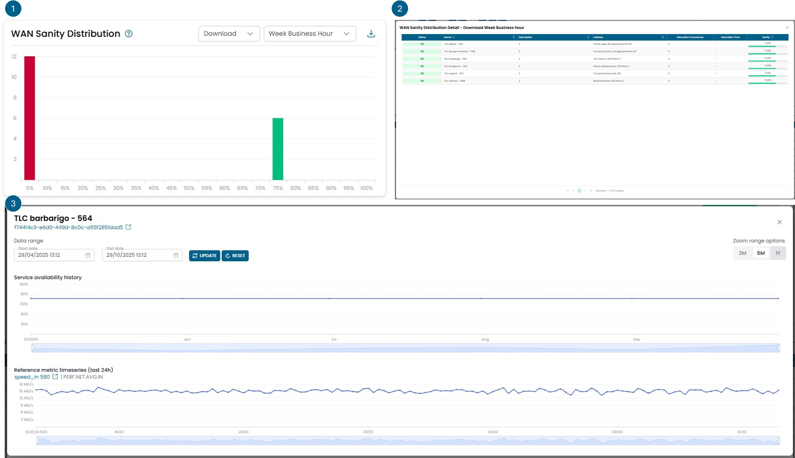
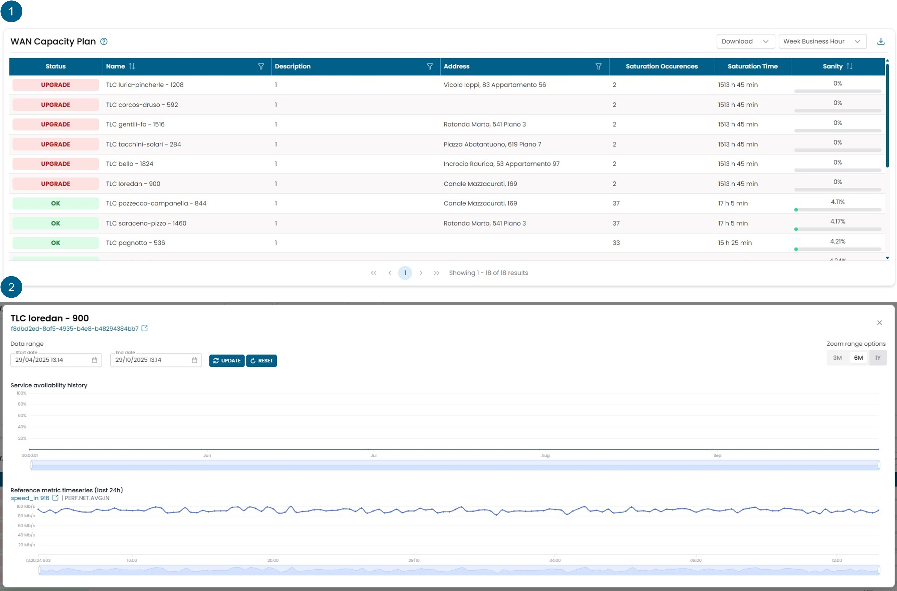

# Network Analytics

## WAN Sanity Distribution

Questo widget rappresenta il valore di sanity di un oggetto di rete e consente
di effettuare il capacity planning dello stesso.

!!! info

    **Cos'è la sanity:** un valore calcolato in base ai trend delle metriche di valore
    di determinati oggetti. La sanity è un indicatore che segnala se un oggetto è sovra-utilizzato
    o sotto-utilizzato rispetto al suo dimensionamento. Qualsiasi oggetto con una sanity dello 0%
    è considerato sovra-utilizzato rispetto al suo dimensionamento, mentre qualsiasi oggetto con
    una sanity del 100% è considerato sotto-utilizzato. Gli oggetti con una sanity maggiore dello
    0% e minore del 100% sono considerati correttamente utilizzati.

Il Capacity Planning analizza il comportamento della metrica selezionata e ne stabilisce la sanity.

Le statistiche della metrica vengono valutate per produrre una stima della rete; se è necessario
un cambio di capacità della linea, questo viene suggerito.

Quattro metriche diverse vengono utilizzate per valutare la sanity:

- **Download:** Banda disponibile in download.
- **Upload:** Banda disponibile in upload.
- **Object:** Metrica composita creata combinando velocità upload, velocità download, latenza e packet loss.
- **Site:** Metrica composita creata combinando la metrica oggetto di tutte le linee su un sito.

Download/Upload forniscono informazioni sull'utilizzo della linea rispetto ai limiti contrattuali,
mentre Object e Site forniscono informazioni sulla qualità del servizio.

Una linea con sanity maggiore dello 0% ha un utilizzo accettabile,
ma più si avvicina allo 0%, maggiore è il consumo di banda.
Una linea con sanity allo 0% necessita di un upgrade.

Il Capacity Planning viene valutato su 5 diverse finestre temporali:

- **24/7:** Comprende tutte le ore dell'intera settimana.
- **Week Business Hour:** Dalle 8:00 alle 19:00, da lunedì a domenica.
- **Week Out Business Hour:** Dalle 19:00 alle 8:00, da lunedì a domenica.
- **Work Week Business Hour:** Dalle 8:00 alle 19:00, da lunedì a venerdì.
- **Work Week Out Business Hour:** Dalle 8:00 alle 19:00, da lunedì a venerdì.

La sanity viene calcolata in base al comportamento delle metriche di valore su scala mensile.

Il widget è composto da 3 viste rappresentate nella figura con i tre numeri.

La prima vista mostra un istogramma che categorizza gli oggetti in base alla loro sanity.
Tutti gli oggetti con una sanity inferiore al 5% rientrano nella colonna rossa.

Cliccando su una delle barre si apre una seconda vista che mostra in dettaglio gli
oggetti contenuti in quella colonna con il valore esatto di sanity per ciascuno.

Cliccando su un oggetto specifico si apre una terza vista con il trend della sanity nel
tempo e i valori della metrica rilevante utilizzata per valutare quella sanity.

## WAN Capacity Plan

Questo widget rappresenta il valore di sanity di un oggetto di rete e consente
di effettuare il capacity planning dello stesso.

!!! info

    **Cos'è la sanity:** un valore calcolato in base ai trend delle metriche di valore
    di determinati oggetti. La sanity è un indicatore che segnala se un oggetto è sovra-utilizzato
    o sotto-utilizzato rispetto al suo dimensionamento. Qualsiasi oggetto con una sanity dello 0%
    è considerato sovra-utilizzato rispetto al suo dimensionamento, mentre qualsiasi oggetto con
    una sanity del 100% è considerato sotto-utilizzato. Gli oggetti con una sanity maggiore dello
    0% e minore del 100% sono considerati correttamente utilizzati.

Il Capacity Planning analizza il comportamento della metrica selezionata e ne stabilisce la sanity.

Le statistiche della metrica vengono valutate per produrre una stima della rete; se è necessario
un cambio di capacità della linea, questo viene suggerito.

Quattro metriche diverse vengono utilizzate per valutare la sanity:

- **Download:** Banda disponibile in download.
- **Upload:** Banda disponibile in upload.
- **Object:** Metrica composita creata combinando velocità upload, velocità download, latenza e packet loss.
- **Site:** Metrica composita creata combinando la metrica oggetto di tutte le linee su un sito.

Download/Upload forniscono informazioni sull'utilizzo della linea rispetto ai limiti contrattuali,
mentre Object e Site forniscono informazioni sulla qualità del servizio.

Una linea con sanity maggiore dello 0% ha un utilizzo accettabile,
ma più si avvicina allo 0%, maggiore è il consumo di banda.
Una linea con sanity allo 0% necessita di un upgrade.

Il Capacity Planning viene valutato su 5 diverse finestre temporali:

- **24/7:** Comprende tutte le ore dell'intera settimana.
- **Week Business Hour:** Dalle 8:00 alle 19:00, da lunedì a domenica.
- **Week Out Business Hour:** Dalle 19:00 alle 8:00, da lunedì a domenica.
- **Work Week Business Hour:** Dalle 8:00 alle 19:00, da lunedì a venerdì.
- **Work Week Out Business Hour:** Dalle 8:00 alle 19:00, da lunedì a venerdì.

La sanity viene calcolata in base al comportamento delle metriche di valore su scala mensile.

Il widget è composto da 2 viste rappresentate nella figura con i numeri.

La prima vista mostra tutti gli oggetti ordinati per sanity.

Cliccando su un oggetto specifico si apre una seconda vista con il trend della sanity nel
tempo e i valori della metrica rilevante utilizzata per valutare quella sanity.

