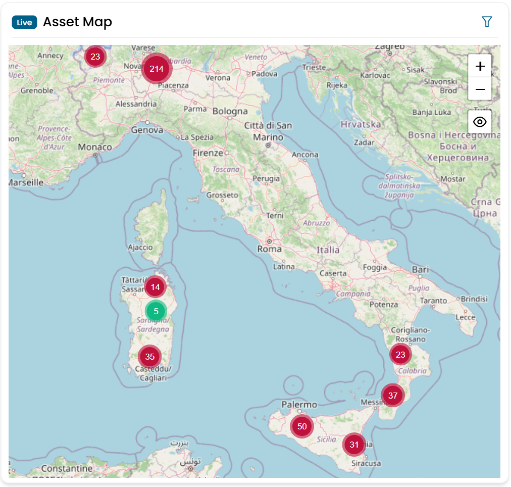

# Asset Map

Il widget Asset Map mostra tutte le filiali su una mappa geografica interattiva. Ogni filiale è rappresentata da un indicatore colorato che riflette lo stato degli aggiornamenti firmware dei dispositivi di sicurezza presenti in quella sede.

Il widget è progettato per funzionare in abbinamento con l'**Assets Hierarchy**: selezionando una filiale nell'elenco della gerarchia, la mappa si centra e zooma automaticamente su quel sito.

---

## Lettura della mappa

Ogni indicatore sulla mappa rappresenta una filiale. Il colore dell'indicatore corrisponde alla severità complessiva del sito:

| Colore | Significato |
|---|---|
| Verde | Tutti i dispositivi sono aggiornati |
| Giallo | Almeno un dispositivo ha un aggiornamento consigliato disponibile |
| Rosso | Almeno un dispositivo ha un aggiornamento critico in sospeso |
| Grigio | Nessun dato sullo stato del firmware disponibile |

Quando più filiali vicine vengono raggruppate in un cluster, l'indicatore del cluster assume il colore dello stato più critico tra i siti raggruppati.

/// caption
Fig.1 — Asset Map — distribuzione geografica delle filiali con indicatori colorati per severità
///

---

## Interazione con la mappa

- **Zoom avanti / zoom indietro** — usa i controlli della mappa o scorri per navigare.
- **Clicca su un cluster** — espande il cluster mostrando i singoli indicatori delle filiali.
- **Clicca su un indicatore di filiale** — apre un pannello riassuntivo per quella filiale.

---

## Sincronizzazione con Assets Hierarchy

Quando il widget **Assets Hierarchy** è presente sulla stessa dashboard, selezionare una filiale nell'elenco fa sì che la mappa si focalizzi e zoomi su quella specifica sede. Il collegamento funziona in una sola direzione: è la gerarchia a guidare il focus della mappa, non viceversa.

Quando il toggle **Show ATMs** viene attivato nell'Assets Hierarchy, la mappa sovrappone anche le posizioni degli ATM per la filiale selezionata — visualizzati come indicatori distinti separati dall'indicatore principale della filiale.

---

## Filtri

| Filtro | Descrizione |
|---|---|
| Codice SOA/UOP | Codice filiale |
| Indirizzo | Indirizzo della filiale |
| Comune | Città |
| Provincia | Provincia (autocomplete) |
| Regione | Regione (select) |
| Polo | Virtual domain / polo (select) |

Tutti i filtri sono esposti anche come **Global Filters** sulla dashboard e sono condivisi con il widget Assets Hierarchy.

!!! note
    Poiché entrambi i widget condividono lo stesso insieme di filtri globali, qualsiasi filtro applicato dal pannello Global Filters della dashboard agisce contemporaneamente sulla mappa e sull'elenco della gerarchia.
