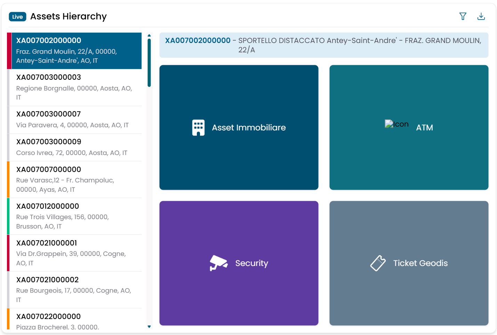
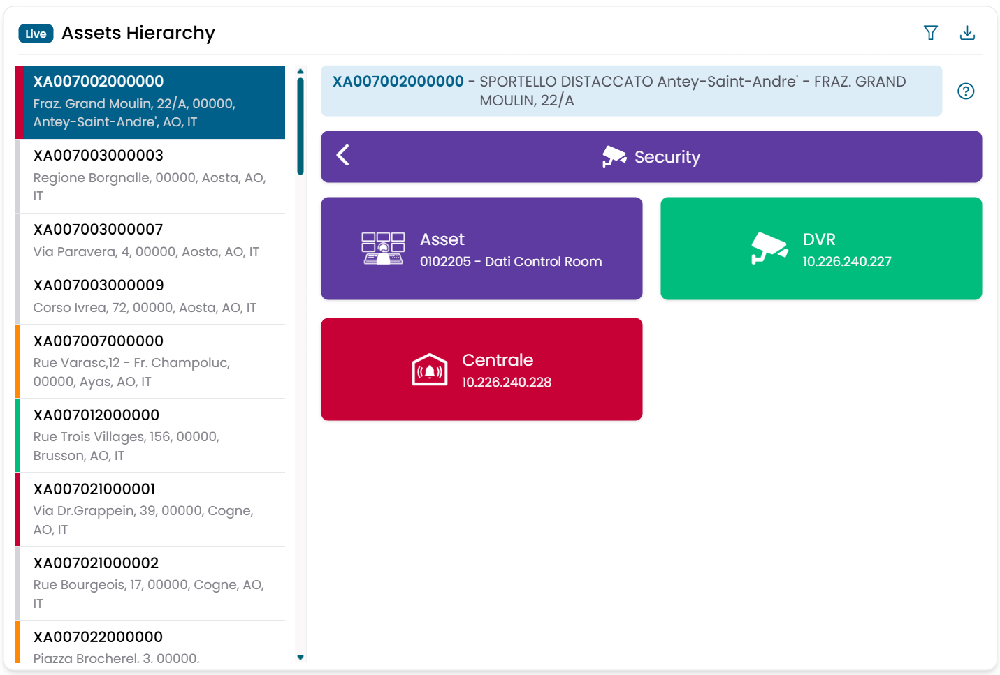

# Assets Hierarchy

Il widget Assets Hierarchy presenta tutti gli asset immobiliari (filiali) come un elenco navigabile. Ogni riga mostra un indicatore di severità derivato dallo stato degli aggiornamenti firmware dei dispositivi di sicurezza presenti in quella sede, e si espande per mostrare i gruppi di dispositivi associati a quel sito.

Il widget è progettato per funzionare in abbinamento con l'**Asset Map**: selezionando una filiale nella gerarchia, la mappa si centra automaticamente su quella posizione.

---

## Lettura dell'elenco

Ogni riga rappresenta una filiale, identificata dal proprio **codice SOA/UOP** e dalla descrizione. L'indicatore di severità colorato riflette lo stato dell'aggiornamento firmware più critico tra i dispositivi presenti in quella sede:

| Colore | Significato |
|---|---|
| Verde | Tutti i dispositivi sono aggiornati |
| Giallo | Almeno un dispositivo ha un aggiornamento consigliato disponibile |
| Rosso | Almeno un dispositivo ha un aggiornamento critico in sospeso |
| Grigio | Nessun dato sullo stato del firmware disponibile |

/// caption
Fig.1 — Assets Hierarchy — elenco filiali con indicatori di severità
///

---

## Navigare una filiale

Clicca su una riga per selezionare la filiale. La vista si espande mostrando i **gruppi di dispositivi** associati a quel sito (ad esempio telecamere di sicurezza, ATM, centraline). Selezionando un gruppo vengono mostrati i singoli dispositivi che contiene.

Quando viene selezionata una filiale, il widget **Asset Map** si centra automaticamente su quella posizione.

/// caption
Fig.2 — Dettaglio filiale — gruppi di dispositivi ed elenco singoli asset
///

---

## Dispositivi ATM

Quando è selezionato il gruppo di dispositivi **ATM**, compare un toggle **Show ATMs**. Attivandolo, le posizioni degli ATM vengono sovrapposte sulla mappa dell'Asset Map per la filiale selezionata — inclusi gli ATM situati fuori dalla sede (ad esempio in supermercati o altre ubicazioni esterne).

---

## Dettaglio dispositivo — Report Ciclo di Vita

Clicca su un singolo dispositivo per aprire la dialog **Report Ciclo di Vita**.

La dialog mostra la scheda completa del dispositivo:

| Campo | Descrizione |
|---|---|
| Codice Filiale | Codice della filiale |
| Descrizione Filiale | Nome della filiale |
| Marca | Marca del dispositivo |
| Modello | Modello del dispositivo |
| Codice Seriale | Numero seriale |
| Indirizzo IP | Indirizzo IP del dispositivo |
| Stato | Stato attuale dell'aggiornamento firmware |
| Versione Firmware | Versione firmware attualmente installata |
| Data Attivazione | Data di attivazione del dispositivo |
| Ultima Rilevazione | Timestamp dell'ultima verifica dello stato |

Sotto i dati del dispositivo, la **Tabella Attività** elenca le operazioni di manutenzione passate con data, descrizione, stato, periodo e note.

Il pulsante **Dismissione Securizzata** avvia la procedura di dismissione sicura del dispositivo selezionato.

---

## Filtri

| Filtro | Descrizione |
|---|---|
| Codice SOA/UOP | Codice filiale |
| Indirizzo | Indirizzo della filiale |
| Comune | Città |
| Provincia | Provincia (autocomplete) |
| Regione | Regione (select) |
| Polo | Virtual domain / polo (select) |

Tutti i filtri sono esposti anche come **Global Filters** sulla dashboard e sono condivisi con il widget Asset Map.

---

## Esportazione dati

Clicca sull'icona di download per esportare un file Excel per la filiale attualmente selezionata. Il file contiene un foglio per ogni gruppo di dispositivi, con la scheda completa di ogni dispositivo. Il nome del file include il codice filiale e un timestamp.
