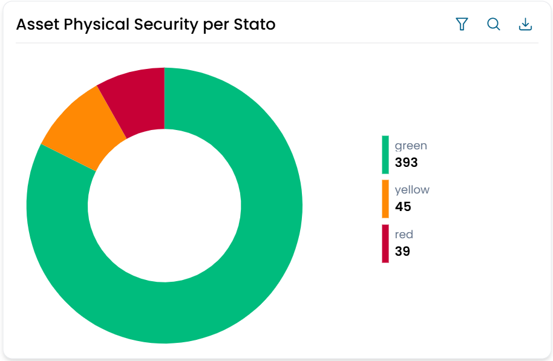
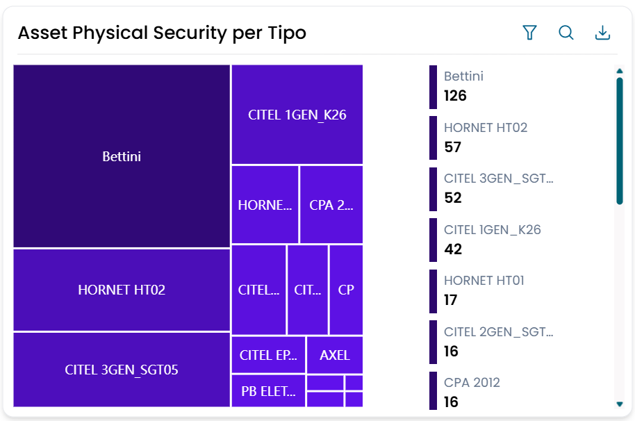
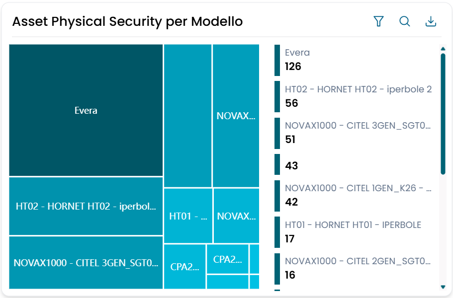
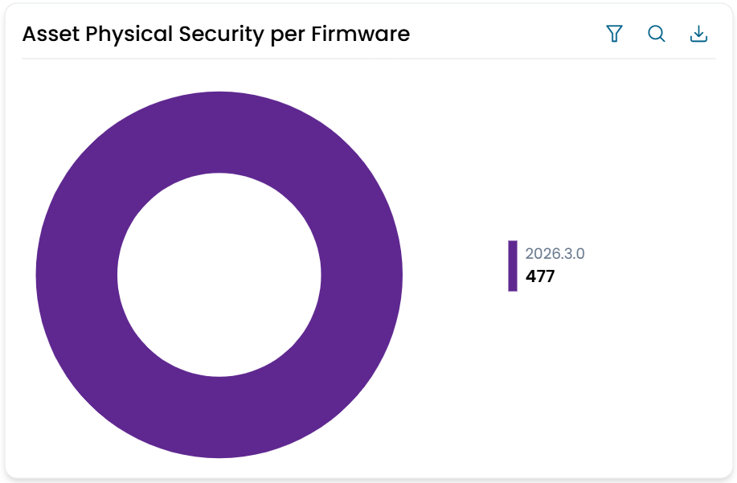
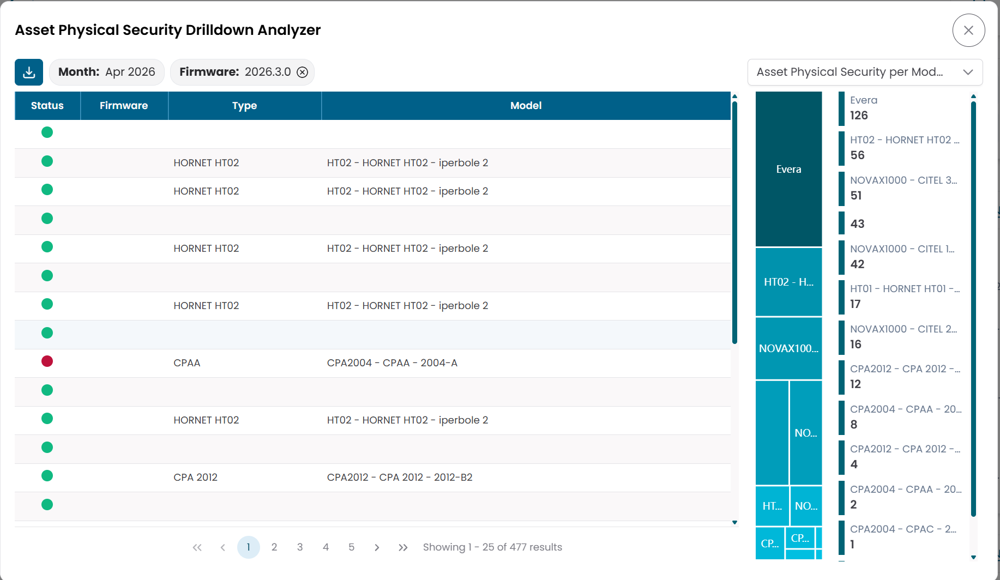

# Physical Security — Capacity Management

I quattro widget Capacity Management mostrano lo stato degli aggiornamenti firmware di tutti i dispositivi di sicurezza fisica monitorati sulla piattaforma. Ogni widget raggruppa lo stesso dataset secondo una dimensione diversa — stato dell'aggiornamento, tipo di dispositivo, modello o versione firmware — offrendo viste complementari delle stesse informazioni.

Cliccando su qualsiasi elemento di un grafico si apre l'**Asset Physical Security Drilldown Analyzer**, una dialog di dettaglio condivisa che permette di esaminare i singoli dispositivi e passare da un raggruppamento all'altro senza chiudere la dialog.

---

## Asset Physical Security per Stato

Mostra la distribuzione dei dispositivi per stato dell'aggiornamento firmware come grafico donut.

| Stato | Significato |
|---|---|
| Verde | Il firmware è aggiornato — nessuna azione necessaria |
| Giallo | È disponibile un aggiornamento minore — aggiornamento consigliato |
| Rosso | È disponibile un aggiornamento maggiore — aggiornamento fortemente consigliato |

Clicca su un segmento per aprire il Drilldown Analyzer filtrato per quello stato.

/// caption
Fig.1 — Asset Physical Security per Stato — distribuzione dei dispositivi per stato dell'aggiornamento firmware
///

---

## Asset Physical Security per Tipo

Mostra il conteggio dei dispositivi raggruppati per **tipo** (ad esempio DVR, centrali, telecamere) come treemap. Ogni riquadro è proporzionale al numero di dispositivi di quel tipo.

Clicca su un riquadro per aprire il Drilldown Analyzer filtrato per quel tipo di dispositivo.

/// caption
Fig.2 — Asset Physical Security per Tipo — conteggio dispositivi per tipo
///

---

## Asset Physical Security per Modello

Mostra il conteggio dei dispositivi raggruppati per **modello** come treemap. Ogni riquadro è proporzionale al numero di dispositivi di quel modello.

Clicca su un riquadro per aprire il Drilldown Analyzer filtrato per quel modello.

/// caption
Fig.3 — Asset Physical Security per Modello — conteggio dispositivi per modello
///

---

## Asset Physical Security per Firmware

Mostra il conteggio dei dispositivi raggruppati per **versione firmware installata** come grafico donut.

Clicca su un segmento per aprire il Drilldown Analyzer filtrato per quella versione firmware.

/// caption
Fig.4 — Asset Physical Security per Firmware — conteggio dispositivi per versione firmware
///

---

## Drilldown Analyzer

Cliccando su qualsiasi elemento di uno dei quattro grafici si apre la dialog **Asset Physical Security Drilldown Analyzer**.

La dialog mostra una tabella dei singoli dispositivi corrispondenti al filtro selezionato:

| Colonna | Descrizione |
|---|---|
| Status | Indicatore dello stato dell'aggiornamento firmware (verde / giallo / rosso) |
| Firmware | Versione firmware attualmente installata sul dispositivo |
| Type | Tipo di dispositivo |
| Model | Modello del dispositivo |

Un **selettore di grafico** in cima alla dialog permette di visualizzare uno qualsiasi dei quattro raggruppamenti — per Stato, Tipo, Modello o Firmware — senza chiudere la dialog. Cliccando su un diverso segmento o riquadro nel grafico incorporato, la tabella dei dispositivi si aggiorna di conseguenza.

/// caption
Fig.5 — Asset Physical Security Drilldown Analyzer — tabella dispositivi con selettore di grafico
///

---

## Esportazione dati

Tutti e quattro i widget supportano il download dei dati. Clicca sull'icona di download per esportare un file Excel con i dati raggruppati (etichetta e conteggio) di quel widget.
