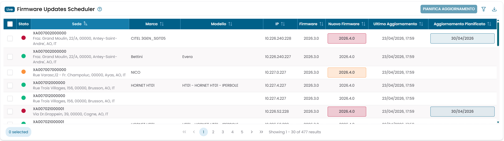
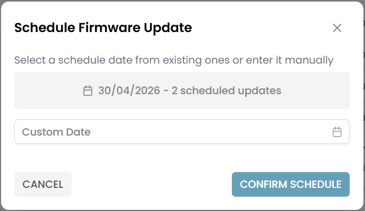

# Firmware Updates Scheduler

Il widget Firmware Updates Scheduler mostra l'elenco completo dei dispositivi di sicurezza monitorati e il loro stato attuale degli aggiornamenti firmware. Permette di selezionare uno o più dispositivi e pianificare una finestra di manutenzione per l'aggiornamento firmware, creando un'apposita voce di downtime.

---

## Lettura della tabella

Ogni riga della tabella rappresenta un dispositivo monitorato. Per impostazione predefinita, la tabella è ordinata per codice filiale.

| Colonna | Descrizione |
|---|---|
| Status | Indicatore dello stato dell'aggiornamento firmware: verde (aggiornato), giallo (aggiornamento minore disponibile), rosso (aggiornamento maggiore in sospeso) |
| Sede | Codice filiale (SOA/UOP) |
| Marca | Marca del dispositivo |
| Modello | Modello del dispositivo |
| IP | Indirizzo IP del dispositivo |
| Firmware | Versione firmware attualmente installata |
| Nuovo Firmware | Ultima versione firmware disponibile, colorata in base all'urgenza dell'aggiornamento |
| Ultimo Aggiornamento | Timestamp dell'ultima verifica dello stato firmware |
| Aggiornamento Pianificato | Data della finestra di manutenzione già programmata, se presente |

/// caption
Fig.1 — Firmware Updates Scheduler — elenco dispositivi con stato aggiornamento e date pianificate
///

---

## Pianificare un aggiornamento firmware

1. Seleziona una o più righe tramite le caselle di selezione.
2. Clicca su **Pianifica Aggiornamento** — il pulsante appare nell'intestazione della tabella non appena almeno una riga è selezionata.
3. Si apre la dialog **Schedule Firmware Update**.

### Scegliere una data

La dialog presenta due opzioni:

- **Aggiornamenti esistenti** — se sono già pianificate delle finestre di manutenzione, ognuna appare come un pulsante toggle che mostra la data e il numero di aggiornamenti già schedulati in quella data (ad esempio *15/05/2026 — 12 scheduled updates*). Clicca un toggle per selezionare quella data.
- **Custom Date** — usa il selettore di data per inserire una data diversa. Sono selezionabili solo date future (da domani in poi).

/// caption
Fig.2 — Dialog Schedule Firmware Update — aggiornamenti esistenti e selettore data personalizzata
///

4. Clicca **Confirm Schedule** per confermare.

### Cosa succede alla conferma

Per ogni dispositivo selezionato:

- Se il dispositivo **non ha già una finestra di manutenzione**, viene creato un nuovo downtime con codice `PHY-MAINTENANCE-firmware-{timestamp}`.
- Se il dispositivo **ha già una finestra di manutenzione schedulata**, il downtime esistente viene aggiornato con la nuova data.

La colonna **Aggiornamento Pianificato** nella tabella si aggiorna per riflettere la nuova pianificazione.

!!! note
    Pianificare un aggiornamento non avvia l'aggiornamento firmware. Il downtime schedulato è un record di pianificazione — l'operazione di aggiornamento effettiva viene gestita separatamente da processi automatizzati che monitorano il calendario dei downtime.

---

## Filtri

| Filtro | Descrizione |
|---|---|
| Codice SOA/UOP | Codice filiale |
| Indirizzo | Indirizzo della filiale |
| Comune | Città |
| Provincia | Provincia (autocomplete) |
| Regione | Regione (select) |
| Polo | Virtual domain / polo (select) |
| Status | Stato dell'aggiornamento firmware (selettore severità) |

I primi sei filtri sono esposti anche come **Global Filters** sulla dashboard.

---

## Esportazione dati

Clicca sull'icona di download per esportare un file Excel dell'elenco completo dei dispositivi. Le colonne esportate sono: Sede, Marca, Modello, Stato, IP, Firmware, Nuovo Firmware, Ultimo Aggiornamento, Aggiornamento Programmato. Il nome del file include un timestamp.
