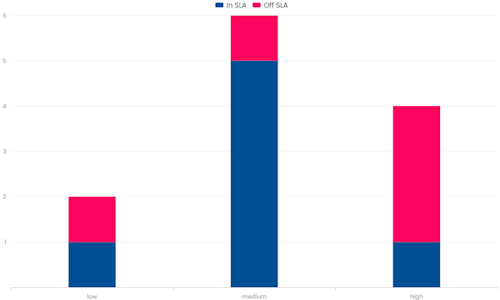

# Support Service KPI

I widget **Support Service KPI** forniscono viste analitiche sui ticket di supporto gestiti attraverso il sistema.

Questi widget consentono di esplorare gli eventi chiusi nel periodo selezionato e di analizzarli secondo diverse dimensioni operative come severità, responsabilità, organizzazione o rispetto degli SLA.

Tutti i widget di questa sezione condividono lo stesso modello di interazione e la stessa interfaccia di drilldown.

## Widget di Analisi degli Eventi

I seguenti widget mostrano il numero di eventi chiusi nel mese corrente, raggruppati per una categoria specifica.

Ogni widget viene visualizzato come un **grafico a ciambella** (donut chart), dove ogni segmento rappresenta il numero di eventi appartenenti a una categoria specifica.

### Interazione con il Widget

Cliccando su un segmento del grafico si apre una **vista di drilldown** filtrata per la categoria selezionata.

In alternativa, cliccando sull'**icona della lente di ingrandimento** si apre la vista di drilldown con l'elenco completo degli eventi.

### Vista di Drilldown

La vista di drilldown mostra una tabella con l'elenco dettagliato degli eventi.

Un menu a tendina consente di cambiare dinamicamente la dimensione di analisi.

Le dimensioni disponibili sono:

- Events by SLA of Taking Charge
- Events by Opening Mode
- Events by Organization
- Events by Responsibility
- Events by Severity

Quando viene selezionata una dimensione, il grafico a ciambella si aggiorna per riflettere la categorizzazione scelta.

Cliccando su un segmento della ciambella si applica un filtro aggiuntivo all'elenco degli eventi.
Questo processo di filtraggio può essere ripetuto più volte, restringendo progressivamente i risultati.

Tutti i filtri attivi vengono visualizzati sopra la tabella.

### Esportazione dei Dati

Sia il widget che la vista di drilldown includono un **pulsante di download** che consente di esportare i dati attualmente visualizzati in **formato XLSX**.

## Viste Disponibili

I widget di analisi degli eventi sono disponibili in più viste predefinite, ciascuna con un criterio di raggruppamento iniziale diverso:

- **Events by Type**
- **Events by Opening Mode**
- **Events by Severity**
- **Events by Responsibility**
- **Events by Organization**
- **Events by SLA of Taking Charge**

Si tratta di configurazioni widget separate, ma condividono tutte lo stesso modello di interazione e l'interfaccia di drilldown.

## Events History by Type

Questo widget mostra la cronologia di tutti gli eventi chiusi nell'ultimo anno, raggruppati per tipo di evento.

## Events by SLA of Resolution

Questo widget mostra il numero di eventi chiusi nel mese corrente raggruppati per **severità dell'evento**, evidenziando se la risoluzione ha rispettato lo SLA definito.

Il grafico viene visualizzato come un **grafico a colonne sovrapposte** dove:

- il **segmento blu** rappresenta gli eventi risolti **entro lo SLA**
- il **segmento rosso** rappresenta gli eventi risolti **fuori dallo SLA**

Ogni colonna corrisponde a un livello di severità dell'evento.

Passando il cursore su una colonna viene visualizzato un **tooltip** con il numero esatto di eventi risolti **In SLA** e **Off SLA**.

### Esportazione dei Dati

Il **pulsante di download** nell'angolo in alto a destra consente di esportare i dati visualizzati nel widget in **formato XLSX**.
